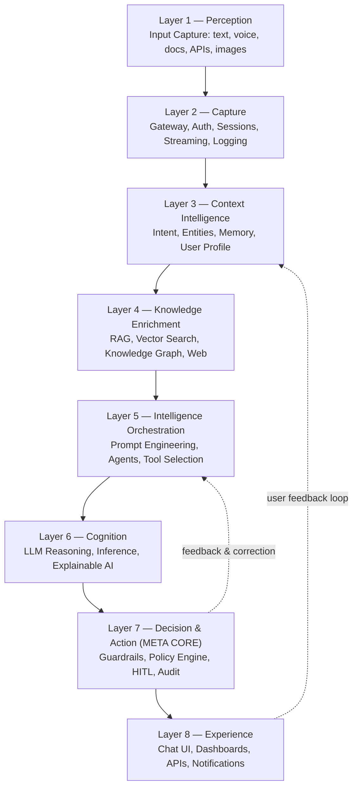

# Vision Document
## Enterprise AI Platform — Octagonal Cognitive Intelligence Framework (OCIF)

**Document 1 of 20**
**Document Type:** Vision Document
**Status:** Draft v1.0 — Pending Approval
**Classification:** Enterprise Architecture / Strategic Planning
**Owning Roles:** CTO, Enterprise Solution Architect, Principal AI Architect, Product Manager

---

## 1. Purpose of This Document

This Vision Document establishes the strategic foundation for the design and development of a production-grade Enterprise AI Platform built on the **Octagonal Cognitive Intelligence Framework (OCIF)**. It defines *why* the platform exists, *what* problem space it addresses, *who* it serves, and *what success looks like*. Every subsequent document in this project — the BRD, PRD, SRS, HLD, LLD, and all downstream architecture and engineering artifacts — must trace back to and remain consistent with the vision, scope boundaries, and principles established here.

This document is intentionally non-technical in its early sections and becomes progressively more architectural toward the end, where it introduces the OCIF layer model at a conceptual level (full technical elaboration is reserved for Document 7: *OCIF Detailed Specification*).

---

## 2. Problem Statement

Enterprises across healthcare, manufacturing, finance, retail, education, logistics, government, and customer support are independently building fragmented AI capabilities:

- A chatbot team building conversational UX with no access to enterprise knowledge.
- A data science team building RAG pipelines with no workflow execution capability.
- An automation team building RPA/workflow tools with no reasoning layer.
- A platform team building agent frameworks with no governance, audit, or human-in-the-loop controls.

This fragmentation produces four systemic problems:

| # | Problem | Consequence |
|---|---------|-------------|
| 1 | **Point-solution sprawl** | Duplicate infrastructure, duplicate LLM spend, inconsistent security posture |
| 2 | **No unifying cognitive architecture** | Each team reinvents intent detection, memory, retrieval, and orchestration |
| 3 | **No governance layer for AI decisions** | Hallucinations, unauditable actions, and unsafe autonomous execution reach production |
| 4 | **No reusable extensibility model** | Every new use case (new department, new industry) requires a ground-up rebuild |

There is currently no widely-adopted, vendor-neutral, layered cognitive architecture that treats **perception, context, knowledge, orchestration, reasoning, decision governance, and experience** as first-class, independently scalable layers of a single coherent platform.

---

## 3. Vision Statement

> **To build a single, modular, cloud-native Enterprise AI Platform — governed by the Octagonal Cognitive Intelligence Framework — that allows any enterprise, in any industry, to safely perceive, understand, reason about, decide upon, and act on information at scale, with full explainability, auditability, and human oversight.**

The platform is not a chatbot, not a RAG application, not an agent framework, and not an AIoT system in isolation — it is the **unifying substrate** that allows all of these paradigms to coexist, share infrastructure, and be governed by one consistent decision and safety layer.

---

## 4. Strategic Objectives

| Objective | Description | Measured By |
|---|---|---|
| **O1 — Unification** | Provide one platform for chat, copilots, autonomous agents, RAG, and workflow automation | Number of use cases served by shared infrastructure |
| **O2 — Governance-First AI** | Every AI-driven action passes through a Decision & Action Layer before execution | % of actions with full audit trail and traceable decision path |
| **O3 — Explainability** | Every response and every autonomous action can be explained and traced to its source | Explainability coverage across Cognition + Decision layers |
| **O4 — Multi-Industry Reusability** | Same core platform deployable to healthcare, finance, manufacturing, retail, education, logistics, government, and support | Number of industries onboarded without core re-architecture |
| **O5 — Enterprise-Grade Scale** | Architecture must support millions of concurrent users | Load test results at HLD/LLD stage |
| **O6 — Human-in-the-Loop Safety** | High-risk or ambiguous decisions require human approval before execution | % of flagged actions routed to human approval |
| **O7 — Vendor-Neutral AI** | Support multiple LLM providers (OpenAI, Claude, Gemini, Llama) interchangeably | Model abstraction layer coverage |

---

## 5. Product Concept — What OCIF Is

The **Octagonal Cognitive Intelligence Framework (OCIF)** models enterprise AI cognition as eight sequential, composable layers — analogous to how the OSI model layered networking. Each layer has a single responsibility, a defined interface to its neighbors, and can be scaled, replaced, or extended independently.

The **Decision & Action Layer (Layer 7)** is the framework's defining innovation ("META CORE"): no tool invocation, workflow execution, or API call reaches production systems without passing through business rule validation, hallucination detection, policy evaluation, guardrail checks, and — where required — human approval, with full decision traceability recorded for audit.

A full technical specification of all eight layers, their interfaces, data contracts, and scaling characteristics is provided in **Document 7 — OCIF Detailed Specification**. This Vision Document intentionally limits itself to the conceptual model.

---

## 6. Target Users and Stakeholders

| Persona | Description | Primary Needs |
|---|---|---|
| **End Business User** | Employee interacting via chat/copilot | Fast, accurate, explainable answers |
| **Enterprise Knowledge Worker** | Uses document intelligence and search | Trustworthy retrieval, source citations |
| **Process Owner** | Owns a business workflow now automated by AI agents | Control, override, audit visibility |
| **Compliance / Risk Officer** | Oversees AI governance | Auditability, policy enforcement, explainability |
| **IT / Platform Team** | Operates and scales the platform | Observability, modularity, cloud-native ops |
| **Enterprise Architect** | Integrates platform into existing IT landscape | API-first design, standards compliance |
| **Executive Sponsor (CxO)** | Funds and measures platform ROI | Multi-industry reuse, cost efficiency, risk reduction |

---

## 7. Scope

### 7.1 In Scope
- Multi-modal input capture (text, voice, documents, images, APIs, databases)
- Enterprise RAG and semantic/knowledge-graph retrieval
- Multi-agent orchestration and tool/function calling
- LLM-agnostic reasoning layer supporting multiple providers
- Governed decision and action execution with human-in-the-loop
- Chat, copilot, and autonomous agent experience surfaces
- Enterprise dashboards, analytics, and feedback-driven continuous learning
- Cross-industry deployment model (healthcare, manufacturing, finance, retail, education, logistics, government, customer support)

### 7.2 Out of Scope (for this phase)
- Training foundation models from scratch (the platform consumes existing LLMs)
- Industry-specific regulatory certification processes (handled per-deployment, not in core platform)
- Non-enterprise / consumer-facing product variants
- Hardware/IoT device manufacturing (platform integrates with AIoT signals but does not build devices)

---

## 8. Guiding Architectural Principles

These principles are binding on every subsequent document:

1. **Layered Separation of Concerns** — Each OCIF layer is independently deployable and scalable.
2. **Governance Before Action** — No AI-initiated action bypasses Layer 7.
3. **Explainability by Design** — Every inference and decision must be traceable to inputs, retrieved knowledge, and reasoning path.
4. **Model Neutrality** — No hard dependency on a single LLM provider.
5. **Cloud-Native & Container-First** — All services are containerized and orchestrated for elastic scale.
6. **API-First Integration** — Every layer exposes well-defined APIs; no hidden coupling.
7. **Security & Privacy by Default** — Authentication, authorization, and data protection are foundational, not additive.
8. **Human-in-the-Loop as a First-Class Capability** — Not a fallback, but a designed control point.
9. **Industry-Agnostic Core, Industry-Specific Configuration** — Vertical needs are met through configuration and plugin extension, not core forks.
10. **Consistency Across Documentation** — Every future document builds on, and does not contradict, this vision.

---

## 9. Reference Technology Direction

The platform's technology direction (elaborated fully in the SRS and HLD) is:

- **Frontend:** React, Next.js, Tailwind CSS, TypeScript
- **Backend:** Python, FastAPI
- **AI Providers:** OpenAI, Claude, Gemini, Llama
- **RAG Frameworks:** LangChain, LlamaIndex
- **Agent Orchestration:** LangGraph
- **Database:** PostgreSQL
- **Vector Database:** Pinecone
- **Cache:** Redis
- **Messaging/Streaming:** Kafka
- **Cloud Provider:** AWS
- **Containers/Orchestration:** Docker, Kubernetes
- **Authentication:** JWT, OAuth2
- **CI/CD:** GitHub Actions

This stack is treated as a baseline reference architecture; it will be justified in detail in the HLD and revisited if constraints emerge during SRS validation.

---

## 10. Success Criteria

The platform will be considered a strategic success when:

1. It serves **at least three distinct industries** using the same OCIF core with only configuration-level changes.
2. **100% of autonomous actions** pass through Layer 7 governance with recorded audit trails.
3. The platform demonstrates **horizontal scalability** to enterprise-scale concurrent load in performance testing (defined quantitatively in the SRS).
4. Business stakeholders can **explain any AI decision** using the platform's own traceability tooling, without engineering assistance.
5. New use cases can be onboarded via **configuration and plugin extension**, not core re-architecture.

---

## 11. Risks and Assumptions (High-Level)

| Type | Item |
|---|---|
| **Assumption** | Enterprise customers will provide API access to internal knowledge sources (documents, databases, APIs) |
| **Assumption** | Multiple LLM providers remain commercially accessible via API throughout the platform lifecycle |
| **Risk** | Hallucination detection at Layer 7 cannot reach 100% accuracy; residual risk must be mitigated via HITL |
| **Risk** | Multi-agent orchestration complexity may introduce latency; addressed architecturally in HLD/LLD |
| **Risk** | Cross-industry compliance requirements (HIPAA, SOC2, GDPR, etc.) will require per-deployment configuration, addressed in Security Design (Document 14) |

---

## 12. Document Traceability

This Vision Document is the root artifact for the project. All subsequent documents must reference it as follows:

- **BRD (Doc 2):** Translates this vision into measurable business requirements.
- **PRD (Doc 3):** Translates business requirements into product features.
- **SRS (Doc 4):** Translates product features into formal functional/non-functional requirements.
- **HLD/LLD (Docs 5–6):** Translate requirements into system and component architecture.
- **OCIF Detailed Spec (Doc 7):** Expands Section 5 of this document into full technical layer specifications.
- **Docs 8–20:** Build out architecture, design, security, UX, roadmap, testing, deployment, operations, and implementation guidance — all constrained by the principles in Section 8.

---

## 13. Approval

| Role | Name | Status |
|---|---|---|
| CTO | *Pending* | ☐ Approved |
| Enterprise Solution Architect | *Pending* | ☐ Approved |
| Principal AI Architect | *Pending* | ☐ Approved |
| Product Manager | *Pending* | ☐ Approved |

**Next Document:** Document 2 — Business Requirements Document (BRD)

---
*End of Vision Document*
