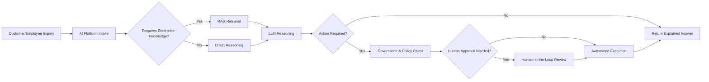

# Business Requirements Document (BRD)
## Enterprise AI Platform — OCIF

**Document 2 of 20** | **Traces to:** Document 1 (Vision Document)
**Status:** Draft v1.0 — Pending Approval

---

## 1. Purpose

This BRD translates the Vision Document's strategic objectives (O1–O7) into concrete, measurable business requirements. It defines the business case, stakeholder needs, business processes affected, and the business rules that Layer 7 (Decision & Action Layer) must ultimately enforce.

---

## 2. Business Objectives

| ID | Business Objective | Traces to Vision Objective |
|---|---|---|
| BO-1 | Reduce cost of AI initiative duplication across business units | O1 (Unification) |
| BO-2 | Reduce compliance/audit risk from ungoverned AI actions | O2 (Governance-First) |
| BO-3 | Increase trust in AI outputs among business and compliance stakeholders | O3 (Explainability) |
| BO-4 | Enable rapid expansion into new verticals without re-platforming | O4 (Multi-Industry Reuse) |
| BO-5 | Support enterprise-scale user growth without re-architecture | O5 (Scale) |
| BO-6 | Reduce risk of erroneous autonomous actions | O6 (HITL Safety) |
| BO-7 | Avoid vendor lock-in and control LLM cost/performance tradeoffs | O7 (Model Neutrality) |

---

## 3. Business Case

### 3.1 Current State (As-Is)
Enterprises run multiple disconnected AI initiatives (chatbots, RPA, RAG pilots, agent prototypes) each with separate infrastructure, security review, and governance — resulting in duplicated spend, inconsistent risk posture, and slow time-to-value for new AI use cases.

### 3.2 Future State (To-Be)
A single OCIF-based platform provides shared perception, context, knowledge, orchestration, cognition, governance, and experience infrastructure. New business use cases are onboarded as configurations (new knowledge sources, new tools, new workflows) rather than new platforms.

### 3.3 Expected Business Value

| Value Driver | Description |
|---|---|
| Cost Reduction | Shared infrastructure eliminates duplicate LLM integration, vector DB, and orchestration builds |
| Risk Reduction | Centralized governance (Layer 7) enforces consistent policy, audit, and HITL controls |
| Speed to Market | New department/industry onboarding via configuration, not custom engineering |
| Revenue Enablement | Faster AI-powered customer-facing capabilities (support, self-service, copilots) |

---

## 4. Stakeholder Business Requirements

| ID | Requirement | Stakeholder | Priority |
|---|---|---|---|
| BR-01 | The platform must allow business users to ask natural-language questions and receive answers grounded in enterprise knowledge | End Business User | Must |
| BR-02 | The platform must cite sources for any answer derived from enterprise documents | Knowledge Worker | Must |
| BR-03 | The platform must allow process owners to define, monitor, and pause automated workflows | Process Owner | Must |
| BR-04 | The platform must provide a full audit trail for every AI-initiated action | Compliance/Risk Officer | Must |
| BR-05 | The platform must support configurable policies per business unit or industry | Compliance/Risk Officer | Must |
| BR-06 | The platform must expose operational dashboards (usage, cost, latency, error rate) | IT/Platform Team | Must |
| BR-07 | The platform must support onboarding of new departments/industries without core rebuild | Enterprise Architect | Must |
| BR-08 | The platform must report ROI metrics (cost per resolved query, automation rate) to sponsors | Executive Sponsor | Should |
| BR-09 | The platform must allow switching or combining LLM providers without workflow rewrite | Enterprise Architect | Must |
| BR-10 | The platform must support human approval gates for high-risk or high-cost actions | Compliance/Risk Officer, Process Owner | Must |

---

## 5. Business Processes Impacted

Impacted business processes include: customer support triage, internal knowledge lookup, document-driven approvals, compliance reporting, order/workflow automation, and cross-department escalation handling.

---

## 6. Business Rules (High-Level — Refined in Layer 7 / Security Design)

| ID | Rule |
|---|---|
| BRULE-01 | No financial, medical, legal, or irreversible action may be auto-executed without human approval unless explicitly whitelisted by policy |
| BRULE-02 | Every AI response derived from retrieved knowledge must include source attribution |
| BRULE-03 | Any detected hallucination or low-confidence output must be flagged before returning to the user |
| BRULE-04 | All actions must be logged with actor (human/agent), timestamp, inputs, and outcome |
| BRULE-05 | Industry-specific regulatory rules (HIPAA, GDPR, SOC2, PCI-DSS) are enforced via configurable policy packs, not hardcoded logic |

---

## 7. Success Metrics (Business KPIs)

| KPI | Target |
|---|---|
| Reduction in duplicate AI infrastructure spend | ≥30% within 12 months of multi-department adoption |
| % of AI actions with complete audit trail | 100% |
| Time to onboard a new industry vertical | ≤6 weeks using configuration only |
| User trust score (survey-based) for AI-provided answers | ≥85% "trustworthy" rating |
| % reduction in manual review time for automatable workflows | ≥40% |

---

## 8. Constraints and Dependencies

- Depends on enterprise customers granting API/data access to internal systems.
- Constrained by per-industry regulatory requirements (detailed in Document 14 — Security Design).
- Dependent on continued commercial availability of external LLM providers (OpenAI, Claude, Gemini, Llama).

---

## 9. Out of Scope (Business)

- Business process re-engineering consulting (platform automates existing approved processes; it does not redesign them).
- Legal liability determination for AI-assisted decisions (handled by customer's own governance/legal function, supported by platform audit data).

---

## 10. Traceability

This BRD's requirements (BR-01 … BR-10) will be decomposed into product features in **Document 3 — PRD**, and into formal functional/non-functional requirements in **Document 4 — SRS**.

---
*End of Business Requirements Document*
