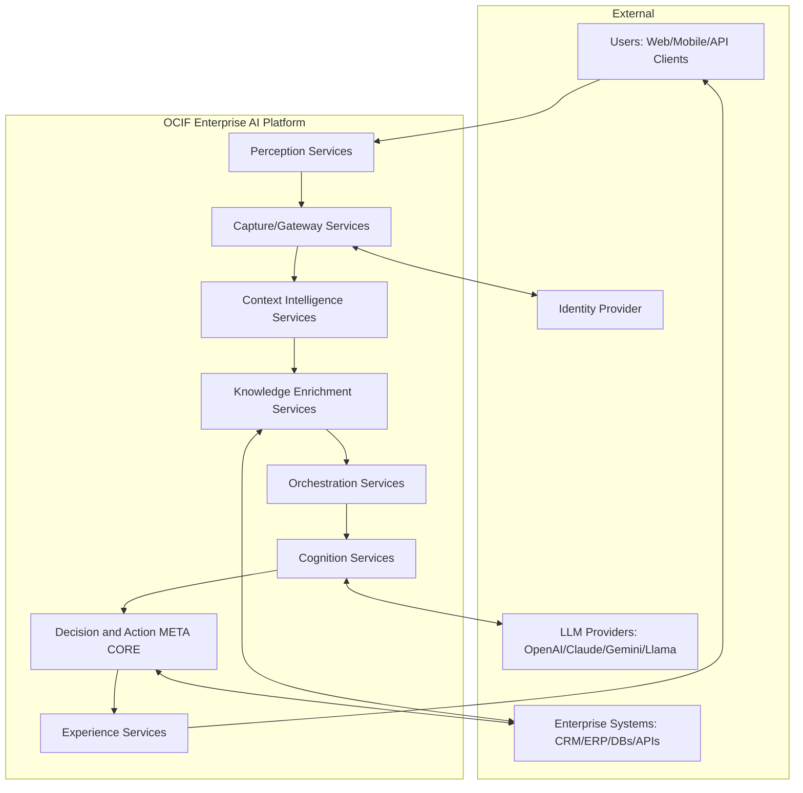
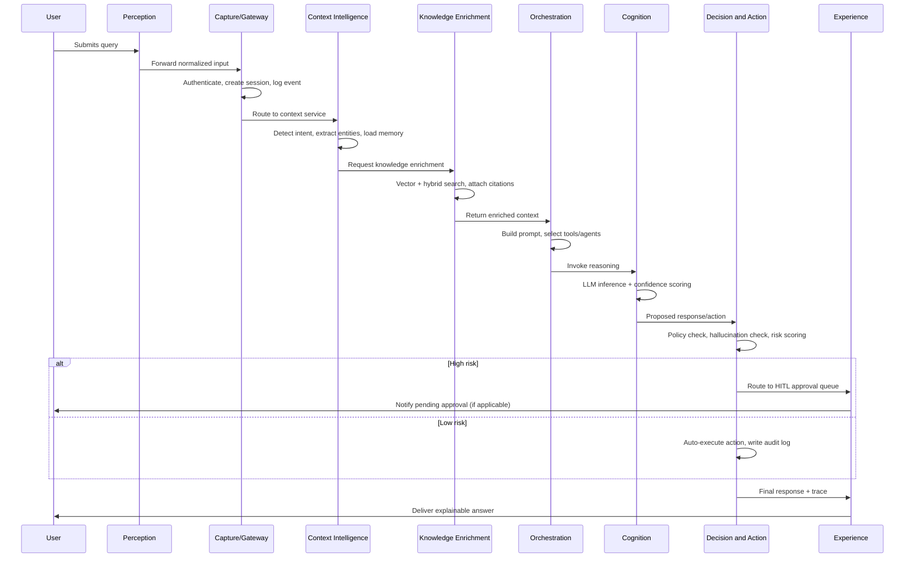
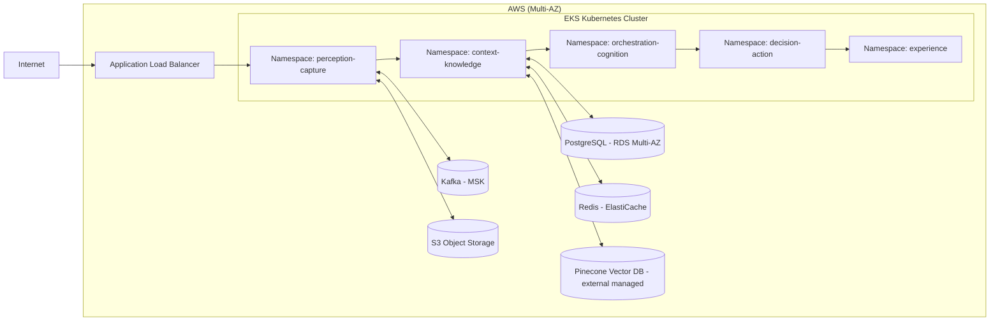

# High-Level Design (HLD)
## Enterprise AI Platform — OCIF

**Document 5 of 20** | **Traces to:** Documents 1–4
**Status:** Draft v1.0 — Pending Approval

---

## 1. Purpose

This HLD defines the system-level architecture realizing the SRS requirements. It maps each OCIF layer to concrete services, defines inter-service communication patterns, and establishes the deployment topology. Component-level detail is deferred to the LLD (Document 6); full architecture diagrams to Document 8.

---

## 2. Architectural Style

- **Microservices**, one service cluster per OCIF layer (independently deployable/scalable)
- **Event-driven** backbone (Kafka) for asynchronous cross-layer communication
- **API Gateway** as the single ingress point (Layer 2)
- **Polyglot persistence**: PostgreSQL (relational/system-of-record), Pinecone (vector), Redis (cache/session)
- **Containerized**, orchestrated via Kubernetes, deployed on AWS

---

## 3. System Context Diagram

---

## 4. Layer-to-Service Mapping

| OCIF Layer | Core Services | Primary Data Stores |
|---|---|---|
| L1 Perception | Input Gateway Service, Document Upload Service, Voice/Vision Ingest Service | S3 (raw files), Kafka |
| L2 Capture | API Gateway, Auth Service, Session Service, Event Bus | Redis (sessions), Kafka |
| L3 Context Intelligence | Intent Detection Service, Entity Extraction Service, Memory Service, User Profile Service | PostgreSQL, Redis |
| L4 Knowledge Enrichment | Ingestion/Indexing Service, RAG Retrieval Service, Knowledge Graph Service, Web Search Connector | Pinecone, PostgreSQL, Graph store |
| L5 Orchestration | Prompt Builder Service, Agent Orchestrator (LangGraph runtime), Tool Registry Service | PostgreSQL, Redis |
| L6 Cognition | LLM Gateway/Abstraction Service, Inference Service, Explainability Service | Model provider APIs (stateless) |
| L7 Decision & Action | Policy Engine, Hallucination Detector, HITL Approval Service, Action Executor, Audit Logger | PostgreSQL (audit — append-only), Kafka |
| L8 Experience | Web App (Next.js), Dashboard Service, Notification Service, Public API Gateway | PostgreSQL, Redis |

---

## 5. Request Flow (Primary Use Case: Chat Query with Governed Action)

---

## 6. Deployment Topology

---

## 7. Cross-Cutting Concerns

| Concern | Approach |
|---|---|
| Security | OAuth2/JWT at gateway, RBAC at service layer, mTLS between services (detailed in Doc 14) |
| Observability | Centralized logging (structured JSON), distributed tracing (OpenTelemetry), metrics (Prometheus/Grafana) |
| Multi-Tenancy | Tenant ID propagated via context on every request; row-level isolation in PostgreSQL, namespace-per-tenant option for regulated industries |
| Resilience | Circuit breakers on LLM provider calls, retry/backoff, graceful degradation to cached/fallback responses |
| Cost Governance | Token usage metering per tenant/workflow at L6, budget alerts surfaced at L8 dashboards |

---

## 8. Scalability Strategy

- Each layer's services scale independently via Kubernetes HPA based on CPU/queue depth.
- L6 (Cognition) scales via stateless LLM gateway replicas with provider-side rate-limit-aware load balancing.
- L4 (Knowledge Enrichment) scales via Pinecone's managed elasticity plus read-replica PostgreSQL for metadata.
- L7 (Decision & Action) audit writes are append-only and partitioned by tenant/date for write scalability.

---

## 9. Technology Justification (Summary)

| Choice | Rationale |
|---|---|
| Kubernetes/Docker | Industry-standard, cloud-portable, supports independent layer scaling |
| Kafka | Decouples layers, supports event replay for audit reconstruction |
| PostgreSQL | ACID guarantees needed for audit/decision records |
| Pinecone | Managed, low-ops vector search at enterprise scale |
| LangGraph | Native support for stateful multi-agent orchestration required by Layer 5 |
| Redis | Low-latency session/memory access required by Layer 3 |

---

## 10. Traceability

Every service in Section 4 maps to functional requirements in the SRS (Document 4). Component-level internals (classes, APIs, schemas) are specified in the LLD (Document 6) and API Specification (Document 9).

---
*End of High-Level Design*
