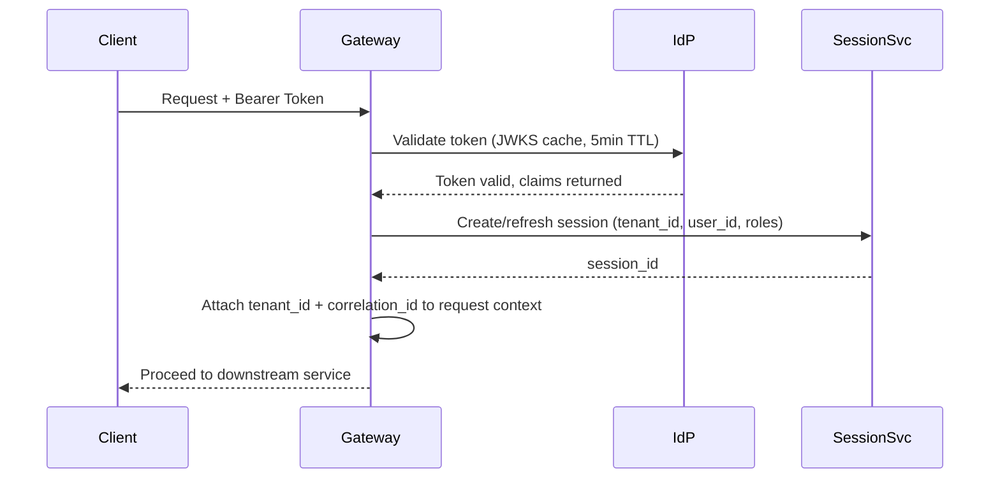
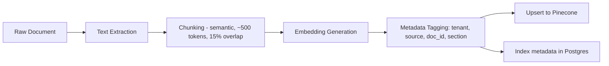
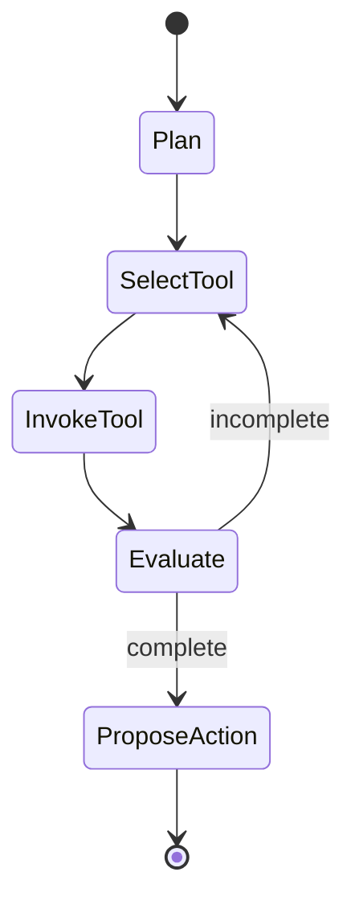
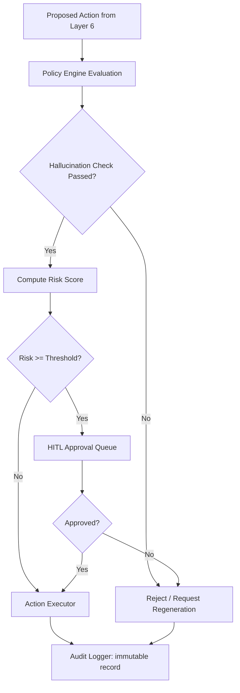

# Low-Level Design (LLD)
## Enterprise AI Platform — OCIF

**Document 6 of 20** | **Traces to:** Documents 1–5
**Status:** Draft v1.0 — Pending Approval

---

## 1. Purpose

This LLD elaborates the HLD's service map (Document 5, Section 4) into component-level design: class/module structure, key interfaces, data flow within services, and algorithmic detail for the most architecturally significant components. Full API contracts are in Document 9; database schemas in Document 8.

---

## 2. Component Design — Layer 2: API Gateway & Auth Service

### 2.1 Responsibilities
Request routing, rate limiting, JWT validation, tenant resolution, request correlation ID injection.

### 2.2 Key Modules
```
gateway/
├── router.py             # Route table, versioned API paths
├── auth_middleware.py     # JWT/OAuth2 validation
├── tenant_resolver.py     # Resolves tenant from token claims/header
├── rate_limiter.py        # Token-bucket per-tenant rate limiting
└── correlation.py         # Injects/propagates X-Correlation-ID
```

### 2.3 Auth Sequence (Detail)


---

## 3. Component Design — Layer 3: Context Intelligence Service

### 3.1 Key Modules
```
context_intelligence/
├── intent_classifier.py   # LLM-lightweight classifier or fine-tuned model
├── entity_extractor.py    # NER pipeline (spaCy / LLM-based fallback)
├── memory_manager.py      # Short-term (Redis) + long-term (Postgres) memory
├── profile_service.py     # User profile CRUD
└── metadata_builder.py    # Assembles request metadata object
```

### 3.2 Memory Manager — Data Model
```python
class ConversationMemory:
    session_id: str
    tenant_id: str
    user_id: str
    turns: list[Turn]          # short-term, Redis, TTL 30min sliding
    summary: str | None        # rolling summary once turns > N
    long_term_facts: list[Fact]  # persisted to Postgres on session close

class Turn:
    role: Literal["user", "assistant", "system"]
    content: str
    timestamp: datetime
    intent: str | None
    entities: list[Entity]
```

### 3.3 Algorithm — Memory Compaction
When `len(turns) > 20`, the service triggers an LLM summarization call to compress the oldest 10 turns into `summary`, preserving token budget for Layer 5 prompt construction while retaining semantic continuity.

---

## 4. Component Design — Layer 4: Knowledge Enrichment Service

### 4.1 Key Modules
```
knowledge_enrichment/
├── ingestion_pipeline.py   # chunking, embedding, metadata tagging
├── vector_retriever.py     # Pinecone query wrapper
├── hybrid_search.py        # combines BM25 (Postgres FTS) + vector rank fusion
├── kg_service.py           # knowledge graph query interface
└── citation_builder.py     # attaches source metadata to retrieved chunks
```

### 4.2 Ingestion Pipeline (Detail)


### 4.3 Hybrid Search Ranking
Reciprocal Rank Fusion (RRF) combines BM25 keyword rank and vector cosine-similarity rank:

```
score(doc) = Σ 1 / (k + rank_i(doc))   for i in {bm25, vector}, k = 60
```

Full detail in Document 10 — RAG Design.

---

## 5. Component Design — Layer 5: Orchestration Service (Agent Runtime)

### 5.1 Key Modules
```
orchestration/
├── prompt_builder.py       # template + context assembly
├── tool_registry.py        # registered tool schema + invocation adapter
├── agent_graph.py          # LangGraph state machine definition
├── planner.py              # decomposes goal into ordered subtasks
└── coordinator.py          # multi-agent message passing
```

### 5.2 Agent State Machine (LangGraph) — Conceptual


### 5.3 Tool Registry Schema
```python
class ToolDefinition:
    tool_id: str
    name: str
    description: str
    input_schema: JSONSchema
    output_schema: JSONSchema
    risk_level: Literal["low", "medium", "high"]
    requires_approval: bool
    endpoint: str            # internal service or external API reference
    auth_scope: str
```

Full detail in Document 12 — Agent Design.

---

## 6. Component Design — Layer 7: Decision & Action (META CORE)

### 6.1 Key Modules
```
decision_action/
├── policy_engine.py         # rule evaluation (rules-as-code, e.g. OPA/Rego or custom DSL)
├── hallucination_detector.py # confidence + source-grounding cross-check
├── risk_scorer.py            # computes composite risk score
├── hitl_queue.py              # approval queue management
├── action_executor.py         # executes approved tool/API calls
└── audit_logger.py            # append-only structured audit event writer
```

### 6.2 Decision Flow (Detail)


### 6.3 Risk Scoring Model (Illustrative)
```
risk_score = w1*action_reversibility + w2*financial_impact
           + w3*data_sensitivity + w4*model_confidence_inverse

if risk_score >= tenant_policy.threshold: route_to_hitl()
```

Weights (`w1..w4`) and thresholds are tenant-configurable policy parameters (see Document 13 — Security Design, Document 14 policy pack schema... *note: cross-reference Document 13/14 numbering as finalized in this batch*).

### 6.4 Audit Log Entry Schema
```python
class AuditEvent:
    event_id: UUID
    tenant_id: str
    session_id: str
    actor: Literal["agent", "human", "system"]
    input_snapshot: dict
    retrieved_sources: list[str]
    model_used: str
    policy_checks: list[PolicyCheckResult]
    decision: Literal["auto_approved", "hitl_approved", "hitl_rejected", "blocked"]
    action_taken: dict | None
    timestamp: datetime
    immutable_hash: str   # chained hash for tamper-evidence
```

---

## 7. Component Design — Layer 8: Experience Layer

### 7.1 Key Modules (Frontend — Next.js/React/TypeScript)
```
experience/
├── chat/                 # chat UI components, streaming response renderer
├── dashboard/             # usage/cost/latency widgets (recharts-based)
├── approval-console/       # HITL review UI
├── admin/                  # tenant/policy/tool configuration UI
└── api-client/              # typed client for Layer 8 public API
```

### 7.2 Streaming Response Handling
Chat responses are streamed via Server-Sent Events (SSE) from the Experience API Gateway, with citation and confidence metadata delivered as structured events interleaved with token streams.

---

## 8. Cross-Service Contracts

All inter-layer calls use versioned internal REST/gRPC contracts defined in Document 9 (API Specification). Event payloads on Kafka topics follow the schema registry pattern (Avro/JSON Schema) to guarantee backward compatibility as layers evolve independently.

---

## 9. Traceability

Each module above satisfies specific FR-xxx requirements from the SRS (Document 4) and realizes the service boundaries defined in the HLD (Document 5, Section 4).

---
*End of Low-Level Design*
