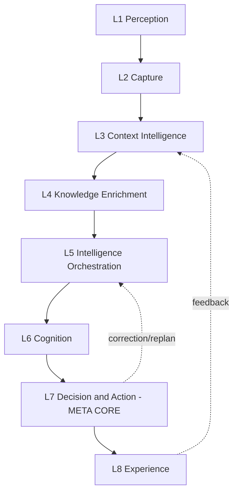

# Octagonal Cognitive Intelligence Framework (OCIF)
## Detailed Technical Specification

**Document 7 of 20** | **Traces to:** Documents 1–6
**Status:** Draft v1.0 — Pending Approval
**Note:** This document is the authoritative technical definition of OCIF, expanding Document 1, Section 5.

---

## 1. Framework Overview

OCIF defines eight layers, each with a **single responsibility**, a **defined input/output contract**, and **independent scalability**. Layers communicate through well-defined interfaces (synchronous API calls for request/response paths, asynchronous events for cross-cutting concerns like logging and learning feedback).

---

## 2. Layer 1 — Perception Layer

**Responsibility:** Normalize all inbound signal types into a canonical internal representation.

| Attribute | Specification |
|---|---|
| Inputs | Text, voice, documents, images, API payloads, database change events |
| Output Contract | `PerceptionEvent { source_type, tenant_id, raw_payload_ref, normalized_text, modality_metadata }` |
| Key Capabilities | Speech-to-text, OCR, document parsing, schema mapping for API/DB inputs |
| Scaling Unit | Stateless workers, scale by input volume/queue depth |
| Failure Mode | Malformed input → rejected with structured error, never silently dropped |

---

## 3. Layer 2 — Capture Layer

**Responsibility:** Secure ingress, identity resolution, and reliable event handoff.

| Attribute | Specification |
|---|---|
| Inputs | `PerceptionEvent` |
| Output Contract | `CaptureEvent { session_id, tenant_id, correlation_id, authenticated_user, PerceptionEvent }` |
| Key Capabilities | API Gateway routing, OAuth2/JWT auth, session lifecycle, Kafka publish, structured logging |
| Scaling Unit | Gateway pods behind ALB, horizontally scaled |
| Failure Mode | Auth failure → 401/403 with no downstream propagation |

---

## 4. Layer 3 — Context Intelligence Layer

**Responsibility:** Understand *what* the user wants and *who* the user is, in context.

| Attribute | Specification |
|---|---|
| Inputs | `CaptureEvent` |
| Output Contract | `ContextFrame { intent, entities[], conversation_memory, user_profile, metadata }` |
| Key Capabilities | Intent classification, NER, short/long-term memory, user profile resolution |
| Scaling Unit | Stateless classifiers + Redis-backed memory store, scaled independently |
| Failure Mode | Low-confidence intent → flagged for clarification prompt rather than guessed silently |

---

## 5. Layer 4 — Knowledge Enrichment Layer

**Responsibility:** Ground the request in relevant enterprise knowledge.

| Attribute | Specification |
|---|---|
| Inputs | `ContextFrame` |
| Output Contract | `EnrichedContext { retrieved_chunks[], citations[], kg_relations[], retrieval_confidence }` |
| Key Capabilities | Vector search (Pinecone), hybrid BM25+vector ranking, knowledge graph traversal, external/web search |
| Scaling Unit | Retrieval services scale with Pinecone's managed elasticity; metadata layer scales via Postgres read replicas |
| Failure Mode | No relevant knowledge found → explicitly marked `no_grounding_found`, passed downstream (never fabricated) |

---

## 6. Layer 5 — Intelligence Orchestration Layer

**Responsibility:** Decide *how* to fulfill the request — which prompt, which tools, which agents, in what order.

| Attribute | Specification |
|---|---|
| Inputs | `EnrichedContext` |
| Output Contract | `OrchestrationPlan { prompt, selected_tools[], agent_graph, execution_order }` |
| Key Capabilities | Prompt templating, tool selection, multi-agent coordination (LangGraph), workflow planning |
| Scaling Unit | Orchestrator instances, stateless plan generation; execution state persisted externally |
| Failure Mode | Planning failure or tool unavailable → fallback to direct LLM response with limitation disclosed |

---

## 7. Layer 6 — Cognition Layer

**Responsibility:** Perform the actual reasoning/inference using LLMs.

| Attribute | Specification |
|---|---|
| Inputs | `OrchestrationPlan` |
| Output Contract | `CognitionResult { generated_content, confidence_score, reasoning_trace, model_used, tool_calls[] }` |
| Key Capabilities | Model-agnostic inference via abstraction layer, classification, summarization, code generation, self-explanation |
| Scaling Unit | Stateless LLM gateway replicas; scale by provider rate limits and request volume |
| Failure Mode | Provider timeout/error → automatic fallback to secondary provider per tenant policy |

---

## 8. Layer 7 — Decision & Action Layer (META CORE)

**Responsibility:** Govern whether and how a proposed output/action is allowed to affect the real world. This is the framework's core innovation.

| Attribute | Specification |
|---|---|
| Inputs | `CognitionResult` |
| Output Contract | `DecisionRecord { decision, policy_checks[], risk_score, executed_action, audit_event_id }` |
| Key Capabilities | Business rule/policy engine, hallucination detection, guardrails, risk scoring, HITL routing, action execution, immutable audit logging |
| Scaling Unit | Policy evaluation is stateless and horizontally scalable; audit log writes are append-only and partitioned |
| Failure Mode | Any policy check failure → action blocked by default (fail-closed, never fail-open) |

### 8.1 Why This Is the Patent-Worthy Innovation
Unlike conventional agent frameworks where tool execution follows directly from LLM output, OCIF interposes a **mandatory, non-bypassable governance layer** between reasoning and action. This provides:
1. A single enforcement point for all business rules regardless of which agent/tool/model produced the proposal.
2. Deterministic, auditable hallucination mitigation independent of model provider.
3. A uniform HITL mechanism reusable across every industry vertical and use case.
4. Cryptographically chained audit records enabling tamper-evident compliance reporting.

---

## 9. Layer 8 — Experience Layer

**Responsibility:** Deliver the explained result to the user and capture feedback for continuous improvement.

| Attribute | Specification |
|---|---|
| Inputs | `DecisionRecord` |
| Output Contract | Rendered UI response / API response / notification, plus `FeedbackEvent` captured on user interaction |
| Key Capabilities | Chat UI, dashboards, notifications, feedback capture, analytics |
| Scaling Unit | Stateless web/API tier, CDN-fronted static assets |
| Failure Mode | Rendering failure → raw structured response still available via API fallback |

---

## 10. Cross-Layer Feedback Loops

| Loop | From → To | Purpose |
|---|---|---|
| Replanning Loop | L7 → L5 | When an action is rejected/blocked, orchestration re-plans with the constraint incorporated |
| Learning Loop | L8 → L3 | User feedback (corrections, ratings) updates user profile and informs future intent/entity resolution |
| Model Improvement Loop | L8 → L6 (offline) | Aggregated feedback exported for prompt/model tuning, outside the real-time path |

---

## 11. Layer Interface Contract Summary

| Layer | Input Type | Output Type |
|---|---|---|
| L1 | Raw multimodal input | `PerceptionEvent` |
| L2 | `PerceptionEvent` | `CaptureEvent` |
| L3 | `CaptureEvent` | `ContextFrame` |
| L4 | `ContextFrame` | `EnrichedContext` |
| L5 | `EnrichedContext` | `OrchestrationPlan` |
| L6 | `OrchestrationPlan` | `CognitionResult` |
| L7 | `CognitionResult` | `DecisionRecord` |
| L8 | `DecisionRecord` | User-facing response + `FeedbackEvent` |

---

## 12. Design Invariants (Binding on All Implementations)

1. No layer may skip a downstream layer (e.g., L5 may never call L7 directly, bypassing L6).
2. L7 is **mandatory** for any action with real-world side effects — no exceptions, no bypass configuration.
3. Every contract object must carry `tenant_id` and `correlation_id` for traceability.
4. Fail-closed default: any uncertainty in policy evaluation blocks the action rather than allowing it.

---

## 13. Traceability

This specification is the technical foundation for Document 8 (System Architecture), Document 12 (Agent Design), and Document 13 (Security Design), all of which must implement the layer contracts defined here without modification.

---
*End of OCIF Detailed Specification*
