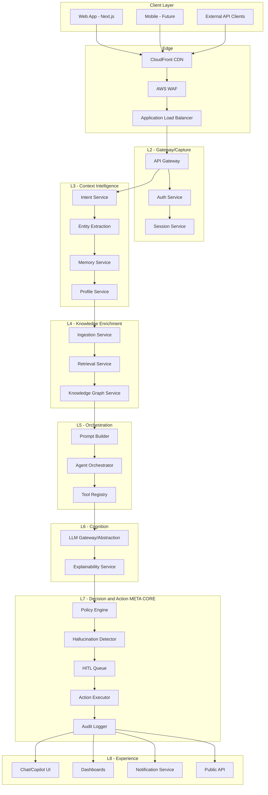
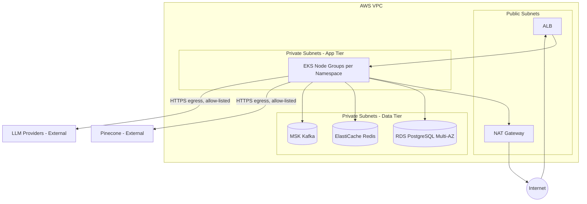
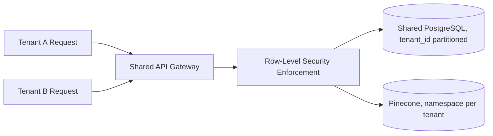
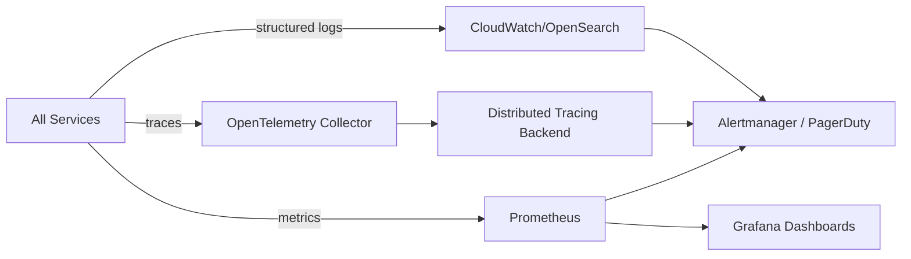

# System Architecture
## Enterprise AI Platform — OCIF

**Document 8 of 20** | **Traces to:** Documents 1–7
**Status:** Draft v1.0 — Pending Approval

---

## 1. Purpose

This document consolidates the full system architecture — combining the HLD (Document 5), LLD (Document 6), and OCIF Detailed Specification (Document 7) — into a single architectural reference with complete diagrams, covering component, deployment, network, and data-flow views.

---

## 2. Architecture Views

### 2.1 Component View

### 2.2 Network Architecture

### 2.3 Data Flow View

Data flows strictly follow the OCIF layer contract sequence defined in Document 7, Section 11 — no layer-skipping is permitted at the network or service-mesh level (enforced via Kubernetes NetworkPolicies restricting east-west traffic to adjacent layers plus the shared data tier).

---

## 3. Service Mesh & Communication Patterns

| Pattern | Usage |
|---|---|
| Synchronous REST/gRPC | Request/response paths within a single user request (L2→L3→L4→L5→L6→L7→L8) |
| Asynchronous Kafka Events | Logging, audit propagation, feedback loops, ingestion pipeline processing |
| Service Mesh (Istio) | mTLS between services, traffic policy, retries/circuit breaking |

---

## 4. Multi-Tenancy Architecture

- **Tenant Isolation Model:** Shared infrastructure, logically isolated data (row-level security in PostgreSQL via `tenant_id`; Pinecone namespace-per-tenant).
- **Regulated Tenant Option:** Dedicated namespace/cluster deployment for tenants requiring physical isolation (e.g., healthcare, government) — configurable at onboarding.

---

## 5. High Availability & Disaster Recovery

| Aspect | Design |
|---|---|
| Compute | Multi-AZ EKS node groups, pod anti-affinity across AZs |
| Database | RDS PostgreSQL Multi-AZ with automated failover |
| Cache | ElastiCache Redis with replica failover |
| Messaging | MSK Kafka with 3x replication across AZs |
| Backup | Automated daily RDS snapshots, point-in-time recovery, cross-region backup replication |
| DR Target | RPO ≤ 15 min, RTO ≤ 1 hour (per NFR-12) |

---

## 6. Observability Architecture

Every request carries a `correlation_id` from L2 through L8, enabling full trace reconstruction for both debugging and Layer 7 audit purposes.

---

## 7. Traceability

This document is the architectural reference implementation of the OCIF layer contracts (Document 7) and the requirements in the SRS (Document 4). Database schema detail follows in Document 9; API contracts in Document 10 *(renumbered — see Section 8 note)*.

> **Numbering note:** Per the requested document order, Database Design is Document 9 and API Specification is Document 10 in this set.

---
*End of System Architecture*
