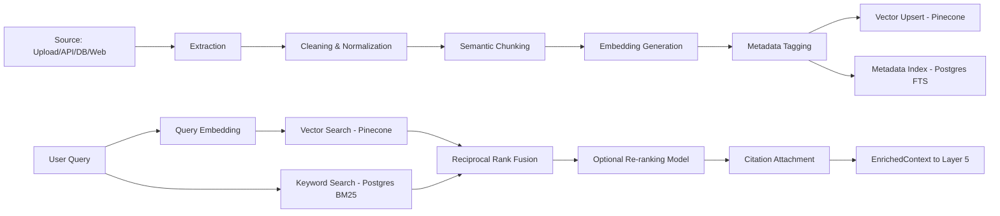

# RAG (Retrieval-Augmented Generation) Design
## Enterprise AI Platform — OCIF, Layer 4

**Document 11 of 20** | **Traces to:** Documents 1–10
**Status:** Draft v1.0 — Pending Approval

---

## 1. Purpose

Defines the detailed design of the Knowledge Enrichment Layer's RAG pipeline: ingestion, chunking, embedding, indexing, retrieval, ranking, and citation attachment.

---

## 2. RAG Pipeline Overview



---

## 3. Ingestion Design

### 3.1 Supported Sources
Document uploads (PDF, DOCX, XLSX, CSV, TXT, HTML), REST/GraphQL API pulls, database CDC feeds, and (when enabled) live web search.

### 3.2 Chunking Strategy

| Parameter | Value | Rationale |
|---|---|---|
| Chunk size | ~500 tokens | Balances context completeness vs. embedding precision |
| Overlap | 15% | Preserves cross-boundary semantic continuity |
| Strategy | Semantic (paragraph/section-aware, not fixed character count) | Reduces mid-sentence/mid-table splits |
| Special handling | Tables, code blocks kept atomic where possible | Prevents structural data corruption |

### 3.3 Embedding Generation
- Embedding model selected per tenant configuration (default: provider-neutral abstraction, e.g., `text-embedding-3-large` equivalent).
- Embeddings versioned; re-embedding triggered on model upgrade via background re-indexing job (zero-downtime, dual-write during migration).

---

## 4. Retrieval Design

### 4.1 Hybrid Search
Combines semantic (vector) and lexical (BM25 via Postgres full-text search) retrieval, fused using **Reciprocal Rank Fusion (RRF)**:

```
score(doc) = Σ 1 / (k + rank_i(doc))    for i in {vector, bm25};  k = 60 (default, tunable)
```

Rationale: vector search captures semantic similarity; BM25 captures exact terminology (product codes, regulatory clause numbers) that embeddings sometimes under-weight — critical for enterprise/legal/technical corpora.

### 4.2 Retrieval Parameters (Tenant-Configurable)

| Parameter | Default |
|---|---|
| top_k (per method, pre-fusion) | 20 |
| top_k (post-fusion, returned) | 8 |
| similarity_threshold | 0.72 (cosine) |
| re-ranking | Optional cross-encoder re-rank on fused top 20 → final 8 |

### 4.3 No-Grounding Handling
If no retrieved chunk exceeds `similarity_threshold`, the pipeline returns `EnrichedContext.retrieval_confidence = 0` and `no_grounding_found = true`. Layer 6/7 must not fabricate an answer in this state — the response is required to disclose the absence of grounding (enforced by Layer 7 hallucination detection, Document 7 Section 8).

---

## 5. Citation Attachment

Every returned chunk carries:
```json
{
  "chunk_id": "uuid",
  "doc_id": "uuid",
  "title": "string",
  "section_ref": "string",
  "score": 0.0-1.0,
  "source_type": "upload|api|database|web"
}
```
Citations are propagated unmodified through Layers 5 and 6 into the final `CognitionResult`, and surfaced to the user in Layer 8 per FR-405/FR-801.

---

## 6. Knowledge Graph Integration

For entity-relationship queries (e.g., "which contracts reference Vendor X"), the Knowledge Graph Service (Layer 4) supplements vector/hybrid search with graph traversal queries, returning `kg_relations[]` merged into `EnrichedContext`. Graph construction is populated incrementally during ingestion via entity/relation extraction (shared NER pipeline with Layer 3).

---

## 7. Freshness & Re-Indexing

| Trigger | Action |
|---|---|
| Document updated | Re-chunk and re-embed affected sections only (diff-based) |
| Document deleted | Tombstone vector + metadata; RLS/tenant purge cascades |
| Scheduled sync (API/DB sources) | Configurable polling or CDC-triggered incremental ingestion |
| Embedding model upgrade | Background dual-write re-indexing, cutover once complete |

---

## 8. Performance Considerations

- Retrieval cache (Redis, 5-min TTL) for repeated/near-duplicate queries within a session.
- Pinecone namespace-per-tenant avoids cross-tenant query interference and supports independent scaling.
- Query embedding generation batched where multiple sub-queries are issued by a single agent plan (Layer 5).

---

## 9. Quality & Evaluation

| Metric | Target | Method |
|---|---|---|
| Retrieval Precision@8 | ≥ 0.85 | Periodic offline eval against labeled query set |
| Grounding Rate | ≥ 95% of in-domain queries return valid grounding | Production monitoring |
| Citation Accuracy | 100% of citations resolve to actual source content | Automated citation validator |

---

## 10. Traceability

Implements FR-401–FR-405 (SRS) and the Layer 4 contract defined in Document 7, Section 5. Consumed by Layer 5 orchestration as specified in Document 12 — Agent Design.

---
*End of RAG Design*
