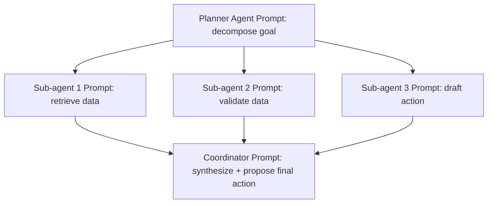

# Prompt Engineering Guide
## Enterprise AI Platform — OCIF, Layer 5/6

**Document 12 of 20** | **Traces to:** Documents 1–11
**Status:** Draft v1.0 — Pending Approval

---

## 1. Purpose

Defines prompt construction standards, templates, and governance for the Intelligence Orchestration Layer (L5) and Cognition Layer (L6), ensuring consistent, explainable, and provider-agnostic prompting across the platform.

---

## 2. Prompt Construction Principles

1. **Provider-agnostic templates** — prompts are authored against an abstraction layer, not a specific model's quirks.
2. **Grounding-first** — retrieved knowledge (Layer 4 output) is always injected before the task instruction, and the model is explicitly instructed not to answer beyond grounded content unless permitted.
3. **Explicit uncertainty instruction** — every system prompt instructs the model to express confidence and flag uncertainty rather than guess.
4. **Structured output requirement** — task prompts request structured (JSON) output where the result feeds Layer 7 policy evaluation, minimizing parsing ambiguity.
5. **No embedded secrets** — prompts never contain credentials, internal infrastructure details, or unredacted PII beyond what's necessary for the task.

---

## 3. Standard Prompt Template (System Layer)

```
SYSTEM:
You are an enterprise assistant operating within the OCIF platform for tenant: {tenant_name}.
Industry context: {industry}.
You must:
- Answer only using the provided knowledge context when grounding is available.
- If no relevant knowledge is found, state this explicitly rather than guessing.
- Provide a confidence score (0.0-1.0) for your answer.
- Cite sources using the provided citation IDs.
- If the task requires an action with real-world effect, propose the action but do not assume it is authorized — output it as a structured proposal only.

KNOWLEDGE CONTEXT:
{retrieved_chunks_with_citations}

CONVERSATION MEMORY:
{summary_and_recent_turns}

USER PROFILE:
{role, department, permissions}

TASK:
{user_query_or_agent_subtask}

OUTPUT FORMAT:
{json_schema_if_structured_required}
```

---

## 4. Task-Specific Templates

### 4.1 Question Answering (Grounded)
```
Answer the user's question using only the KNOWLEDGE CONTEXT above.
Respond in this JSON structure:
{ "answer": "string", "confidence": number, "citations": ["chunk_id", ...], "grounded": boolean }
```

### 4.2 Action Proposal (Agent → Layer 7)
```
Based on the task and available tools, propose the single next action.
Respond in this JSON structure:
{
  "action_type": "tool_call | clarify | final_answer",
  "tool_id": "string | null",
  "tool_input": {},
  "rationale": "string",
  "confidence": number,
  "risk_self_assessment": "low | medium | high"
}
```

### 4.3 Summarization
```
Summarize the following content in {max_length} words, preserving factual accuracy.
Do not introduce information not present in the source.
Respond as: { "summary": "string", "source_coverage": "full | partial" }
```

### 4.4 Classification
```
Classify the input into exactly one of the following categories: {category_list}.
Respond as: { "category": "string", "confidence": number }
```

---

## 5. Multi-Agent Prompt Coordination

For multi-agent workflows (Layer 5), each agent receives a **role-scoped prompt** derived from the shared task context but restricted to its specific responsibility, preventing scope creep and reducing token cost:



Each sub-agent prompt includes only the context relevant to its subtask plus a compact summary of prior agent outputs — not the full conversation history — to control context window growth.

---

## 6. Prompt Governance & Versioning

| Practice | Detail |
|---|---|
| Version control | All prompt templates stored as versioned artifacts (Git-backed), not hardcoded in application code |
| A/B evaluation | New template versions evaluated against a labeled test set before promotion |
| Tenant overrides | Tenants may customize task prompts within a governed template schema (cannot remove grounding/uncertainty/citation instructions) |
| Audit linkage | Each `CognitionResult` records the exact prompt template version used, for Layer 7 audit traceability |

---

## 7. Anti-Patterns (Explicitly Disallowed)

- Instructing the model to "always sound confident" — conflicts with FR-603/NFR-07 (confidence scoring, explainability).
- Omitting the grounding instruction to save tokens — increases hallucination risk, violates Layer 7 invariants (Document 7, Section 12).
- Embedding tenant-specific secrets or credentials directly in prompt text — violates Security Design (Document 13).
- Free-text-only output for any prompt whose result feeds an automated action — structured output is mandatory for Layer 7 parsing.

---

## 8. Provider-Specific Adaptation Layer

The LLM Gateway (Layer 6) applies light provider-specific formatting adjustments (e.g., system/user role conventions, function-calling schema differences) **after** the provider-agnostic template is resolved, keeping the authored template itself portable across OpenAI, Claude, Gemini, and Llama.

---

## 9. Traceability

Implements FR-501 (dynamic prompt construction) and FR-604 (explainability trace) from the SRS, and supports the hallucination-detection invariant defined in Document 7, Section 8.

---
*End of Prompt Engineering Guide*
