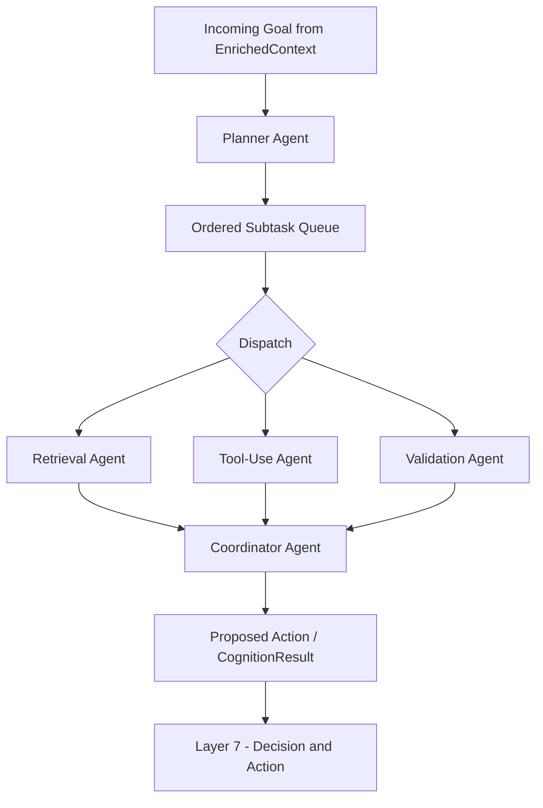
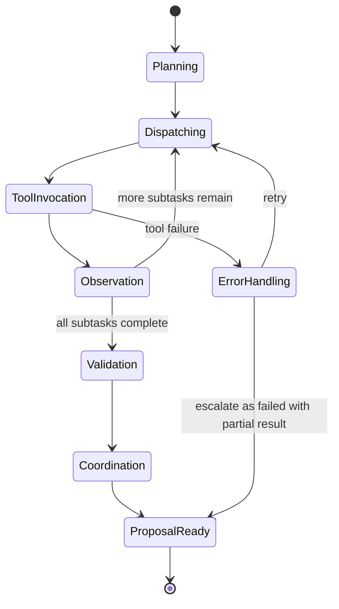

# Agent Design
## Enterprise AI Platform — OCIF, Layer 5

**Document 13 of 20** | **Traces to:** Documents 1–12
**Status:** Draft v1.0 — Pending Approval

---

## 1. Purpose

Defines the multi-agent architecture within the Intelligence Orchestration Layer, including agent types, coordination patterns, tool invocation protocol, and the mandatory handoff to Layer 7 governance.

---

## 2. Agent Taxonomy

| Agent Type | Responsibility | Example |
|---|---|---|
| **Planner Agent** | Decomposes a goal into ordered subtasks | Break "process this invoice" into extract → validate → approve → post |
| **Retrieval Agent** | Invokes Layer 4 to gather grounding knowledge | Fetch relevant policy documents |
| **Tool-Use Agent** | Invokes registered tools/APIs | Call ERP API to check inventory |
| **Validation Agent** | Cross-checks outputs against rules/data before proposing action | Verify invoice total matches PO |
| **Coordinator Agent** | Synthesizes sub-agent outputs into a single proposed action | Merge validation + tool results into final proposal |

All agent types are built on the same LangGraph state-machine runtime (Document 6, Section 5) and share the Tool Registry.

---

## 3. Agent Runtime Architecture



---

## 4. Agent State Machine (LangGraph)



---

## 5. Tool Invocation Protocol

1. Agent selects a tool from the Tool Registry (Document 9, Section 4.4) matching subtask requirements.
2. Agent validates its intended input against `tool.input_schema` before invocation.
3. Agent invokes the tool via the Action Executor's **sandboxed invocation interface** — agents never call external APIs directly; all calls are proxied through Layer 5's tool adapter, which enforces auth scope and timeout.
4. Tool output is validated against `tool.output_schema`; malformed output triggers `ErrorHandling`.
5. If `tool.requires_approval = true`, the tool's *result* can be observed by the agent for planning purposes, but any resulting **action with side effects** is still routed through Layer 7 — agents cannot bypass governance by pre-emptively executing.

> **Critical Invariant:** Agents *propose*; only Layer 7 *authorizes execution* of side-effecting actions. Read-only tool calls (e.g., data lookups) may execute directly within Layer 5 for planning purposes; write/mutate/financial/irreversible actions always terminate at a `ProposalReady` state consumed by Layer 7.

---

## 6. Multi-Agent Coordination Patterns

| Pattern | Use Case |
|---|---|
| **Sequential** | Steps must occur in strict order (extract → validate → approve) |
| **Parallel** | Independent subtasks (fetch data from 3 systems simultaneously) |
| **Hierarchical (Planner-Worker)** | Complex goals needing decomposition and re-planning |
| **Debate/Cross-Validation** | High-stakes classification where two agents independently assess and a third reconciles disagreement |

---

## 7. Agent Memory & Context Scoping

Each agent receives a **scoped context slice** (Document 12, Section 5) rather than the full session history, to:
- Reduce token cost and latency
- Prevent unrelated context from influencing a narrow subtask
- Improve explainability (each agent's reasoning trace is attributable to a bounded input)

---

## 8. Failure Handling & Timeouts

| Scenario | Handling |
|---|---|
| Tool timeout | Retry with exponential backoff (max 3 attempts), then escalate to `ErrorHandling` |
| Tool returns invalid schema | Reject, log, retry once with corrective prompt, else escalate |
| Planner produces circular/unbounded plan | Max-step guard (configurable, default 15 steps) forces termination with partial result |
| Agent disagreement (debate pattern) | Escalated to HITL if reconciliation confidence < threshold |

---

## 9. Explainability Requirements

Every agent step emits a trace entry:
```json
{
  "step_id": "uuid",
  "agent_type": "planner|retrieval|tool_use|validation|coordinator",
  "input_summary": "string",
  "output_summary": "string",
  "tool_invoked": "string|null",
  "confidence": number,
  "duration_ms": number
}
```
The full ordered trace is attached to `CognitionResult.reasoning_trace` and surfaced through Layer 7's audit record (Document 9, Section 4.5) and Layer 8's explainability UI.

---

## 10. Traceability

Implements FR-502–FR-505 (SRS) and realizes the L5 contract in Document 7, Section 6, with strict adherence to the L7 governance invariant in Document 7, Section 12.

---
*End of Agent Design*
