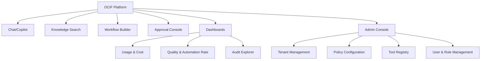
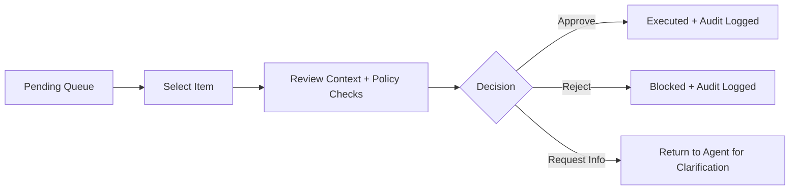

# UI/UX Design
## Enterprise AI Platform — OCIF, Layer 8

**Document 15 of 20** | **Traces to:** Documents 1–14
**Status:** Draft v1.0 — Pending Approval

---

## 1. Purpose

Defines the experience design for the Experience Layer's surfaces: Chat/Copilot, Dashboards, HITL Approval Console, and Admin Console — covering information architecture, key screens, and interaction patterns tied to the PRD features (Document 3) and functional requirements (Document 4).

---

## 2. Design Principles

1. **Explainability visible by default** — citations and confidence are always shown inline, never hidden behind a click.
2. **Trust through transparency** — any AI-proposed action clearly distinguishes "proposed" from "executed."
3. **Progressive disclosure** — power-user detail (full audit trace, raw retrieval scores) available on demand, not cluttering the default view.
4. **Consistency across surfaces** — shared design tokens/components (Tailwind + shared component library) across Chat, Dashboard, and Admin.
5. **Accessibility** — WCAG 2.1 AA compliance across all surfaces.

---

## 3. Information Architecture



---

## 4. Key Screen: Chat Interface

**Layout:** Left sidebar (conversation history) · Center (message thread) · Right panel (collapsible — citations, confidence, decision trace for the selected message).

**Message Component Elements:**
- Response text (streamed)
- Confidence badge (e.g., "92% confidence" with color coding: green ≥85%, amber 60–84%, red <60%)
- Citation chips (clickable → opens source excerpt)
- "View decision trace" link (opens right panel with full L1–L8 trace summary)
- Feedback controls (thumbs up/down, "suggest correction")

**Action Proposal Card (inline, when an agent proposes a governed action):**
```
┌─────────────────────────────────────────┐
│ ⚙ Proposed Action: Issue refund $240.00  │
│ Risk: Medium · Requires approval          │
│ Rationale: Order #4471 meets return...    │
│ [ View Details ]  [ Approve ]  [ Reject ] │
└─────────────────────────────────────────┘
```
Only rendered for users with the appropriate role (Document 14, Section 3.1); other users see a "Pending review" status only.

---

## 5. Key Screen: Approval Console (HITL)

- Queue view: sortable by risk score, age, tenant/department.
- Detail view: full context (input, retrieved sources, proposed action, policy checks, risk score breakdown) before approve/reject.
- Bulk actions restricted to low-risk-banded items only; high-risk items always require individual review (enforced server-side, not just UI-hidden).



---

## 6. Key Screen: Dashboards

| Widget | Metric | Source |
|---|---|---|
| Usage Trend | Requests/day, tokens/day | `usage_metrics` (Doc 9) |
| Cost Tracker | Cost by tenant/workflow | `usage_metrics.cost_usd` |
| Automation Rate | % actions auto-approved vs HITL vs blocked | `audit_events.decision` aggregation |
| Latency | p50/p95/p99 response time | Observability stack (Doc 8, Section 6) |
| Quality | Avg confidence, feedback rating trend | `feedback` table |

---

## 7. Key Screen: Admin Console — Policy Configuration

Form-based policy builder mapped to the rules-as-code schema (Document 14, Section 6):
- Rule name, condition builder (visual, no-code), risk threshold slider, requires-approval toggle.
- "Test Policy" sandbox — run a sample proposed action through the rule before activating.
- Version history with diff view and rollback.

---

## 8. Responsive & Multi-Surface Strategy

| Surface | Approach |
|---|---|
| Web (primary, MVP) | Next.js responsive layout, desktop-first with tablet/mobile breakpoints |
| Embeddable Copilot Widget | Lightweight iframe/web-component build, configurable theme tokens per tenant |
| Native Mobile (Future — Document 16 roadmap) | React Native reusing shared design tokens |

---

## 9. Design System

- **Framework:** Tailwind CSS + shared component library (buttons, cards, badges, data tables, form controls).
- **Typography/Color:** Tenant-themeable (logo, primary color) within a governed design-token schema — prevents inconsistent, unaccessible custom themes.
- **Iconography:** Consistent icon set for confidence levels, risk levels, and decision states across all screens.

---

## 10. Traceability

Realizes PRD features F-01, F-02, F-06, F-08, F-09, F-11, F-14 (Document 3) and functional requirements FR-801–FR-806 (Document 4).

---
*End of UI/UX Design*
