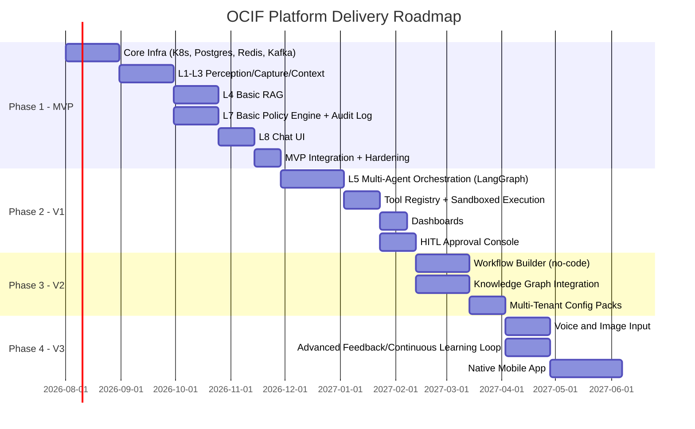

# Development Roadmap
## Enterprise AI Platform — OCIF

**Document 16 of 20** | **Traces to:** Documents 1–15
**Status:** Draft v1.0 — Pending Approval

---

## 1. Purpose

Sequences delivery of the platform across phases, aligned to the PRD release strategy (Document 3, Section 7) and dependent on the architecture defined in Documents 5–15.

---

## 2. Phased Delivery Plan

---

## 3. Phase Detail

### Phase 1 — MVP (Target: ~4.5 months)
**Goal:** Prove the end-to-end OCIF pipeline (L1→L8) for a single tenant with grounded chat and governed responses.
- Deliverables: F-01, F-03, F-04, F-09, F-11, F-12 (Document 3)
- Exit Criteria: 100% of test actions pass through Layer 7; p95 latency ≤3s; audit log verified tamper-evident.

### Phase 2 — V1 (Target: +3 months)
**Goal:** Enable multi-agent automation and operational visibility.
- Deliverables: F-06, F-07, F-14
- Exit Criteria: Tool registry supports ≥10 registered enterprise tools; dashboard live for pilot tenant.

### Phase 3 — V2 (Target: +2.5 months)
**Goal:** Enable low-code workflow authoring and multi-industry configuration.
- Deliverables: F-05, F-08, F-17
- Exit Criteria: Second and third industry vertical onboarded via configuration only (validates BO-4/O4).

### Phase 4 — V3 (Target: +3 months)
**Goal:** Expand modality support and close the continuous-learning loop.
- Deliverables: F-19, F-15, native mobile
- Exit Criteria: Voice/image input in production for at least one tenant; feedback loop demonstrably improves retrieval precision over a measured period.

---

## 4. Team Structure by Phase

| Phase | Core Team |
|---|---|
| Phase 1 | Solution Architect, 3 Backend Engineers, 1 Frontend Engineer, 1 DevOps Engineer, 1 QA Engineer |
| Phase 2 | + 2 Backend Engineers (agent/tools), 1 Data Engineer, 1 Additional QA |
| Phase 3 | + 1 Frontend Engineer (workflow builder), 1 Knowledge Engineer (graph) |
| Phase 4 | + 1 ML Engineer (voice/vision), 1 Mobile Engineer |

---

## 5. Dependencies & Sequencing Rationale

- L7 (governance) is built in Phase 1 alongside L1–L4, not deferred, because the architecture's core invariant (Document 7, Section 12) requires governance to exist before any action-capable feature ships — even MVP chat responses flow through basic policy/audit checks.
- Multi-agent orchestration (Phase 2) depends on the Tool Registry schema finalized in Document 9/13, and on L7 already being operational to govern agent-proposed actions.
- Multi-tenant configuration packs (Phase 3) depend on the policy engine (Phase 1) and RBAC model (Document 14) being stable.

---

## 6. Risk-Adjusted Milestones

| Milestone | Risk | Mitigation |
|---|---|---|
| MVP Layer 7 hallucination detection accuracy | May underperform target initially | Conservative default thresholds (favor HITL routing over auto-approval) until production data available |
| Multi-agent latency (Phase 2) | Complex plans may exceed latency NFR | Max-step guards (Doc 13, Section 8), parallel dispatch where possible |
| Multi-tenant onboarding time (Phase 3 exit criteria) | Config complexity may exceed 6-week target | Reusable industry policy-pack templates prepared in advance |

---

## 7. Traceability

This roadmap sequences delivery of PRD features (Document 3) and SRS requirements (Document 4) consistent with the architecture in Documents 5–15. Detailed test coverage per phase is defined in Document 17 — Testing Strategy.

---
*End of Development Roadmap*
