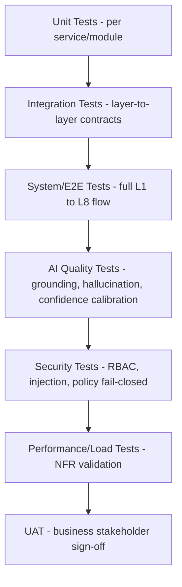

# Testing Strategy
## Enterprise AI Platform — OCIF

**Document 17 of 20** | **Traces to:** Documents 1–16
**Status:** Draft v1.0 — Pending Approval

---

## 1. Purpose

Defines the QA strategy across unit, integration, system, AI-specific (hallucination/policy), security, performance, and UAT testing, mapped to the architecture and requirements defined in prior documents.

---

## 2. Testing Pyramid

---

## 3. Test Levels

### 3.1 Unit Testing
- Every service module (Document 6 LLD) covered with unit tests; minimum 80% code coverage on core services (L3, L4, L5, L7).
- Policy engine rule evaluation covered with exhaustive rule-combination test matrices.

### 3.2 Integration Testing
- Validates each OCIF layer contract (Document 7, Section 11) — e.g., `ContextFrame` → `EnrichedContext` schema compliance tested at the L3/L4 boundary.
- Contract tests run in CI on every service change to prevent silent breaking changes across independently deployable layers.

### 3.3 System / End-to-End Testing
- Full request traces from chat input (L1) to governed action execution and response (L8), covering both auto-approved and HITL-routed paths.
- Multi-tenant isolation explicitly tested: verify tenant A can never retrieve tenant B's data via any API path.

### 3.4 AI Quality Testing (Distinct from Conventional QA)

| Test Category | Method | Target (from SRS/RAG Design) |
|---|---|---|
| Retrieval Precision | Labeled query/document eval set | Precision@8 ≥ 0.85 (Doc 11) |
| Grounding Rate | Automated check: is every citation traceable to real content | 100% citation accuracy |
| Hallucination Detection Rate | Adversarial test set with known-unanswerable queries | ≥95% correctly flagged as ungrounded |
| Confidence Calibration | Compare stated confidence vs. actual correctness on labeled set | Calibration error ≤10% |
| Prompt Injection Resistance | Inject adversarial instructions into retrieved documents, verify system prompt integrity holds | 100% of test cases blocked/ignored |

### 3.5 Security Testing
- Full RBAC matrix (Document 14, Section 3.1) tested with automated role-based access attempts.
- Fail-closed verification: deliberately malformed/ambiguous policy inputs must always result in blocked action, never auto-approval.
- Penetration testing per Document 14, Section 8.

### 3.6 Performance & Load Testing
- Load tests validate NFR-01 (p95 ≤3s) and NFR-02 (scale to millions of users) using simulated traffic ramps.
- Chaos testing: simulate LLM provider outage, verify fallback provider switch (FR-601) and graceful degradation.

### 3.7 User Acceptance Testing (UAT)
- Conducted with representative personas (Document 1, Section 6) per pilot tenant.
- Acceptance criteria tied directly to PRD user stories (Document 3, Section 4).

---

## 4. Test Environment Strategy

| Environment | Purpose |
|---|---|
| Dev | Per-developer/feature branch, synthetic data only |
| CI/Test | Automated test suite execution on every PR |
| Staging | Production-like, multi-tenant simulation, pre-release validation |
| Production | Canary release + feature flags for gradual rollout |

---

## 5. AI-Specific Test Data Governance

- Test/eval datasets are synthetic or de-identified — no production PII used in non-production environments (aligned with Document 14, Section 4).
- Adversarial/red-team test sets maintained and expanded continuously as new prompt-injection or jailbreak patterns are identified in production monitoring.

---

## 6. Defect Severity & Exit Criteria

| Severity | Definition | Release Gate |
|---|---|---|
| Critical | Governance bypass, data leakage, tenant isolation failure | Zero tolerance — blocks release |
| High | Incorrect hallucination flagging, RBAC gap | Must be resolved or explicitly risk-accepted by Security Architect |
| Medium | UX defect, non-blocking performance degradation | Tracked, resolved within SLA |
| Low | Cosmetic | Backlog |

---

## 7. Continuous Testing in CI/CD

Automated test suites (unit, integration, contract, security regression, AI quality regression) run on every pull request via GitHub Actions (Document 18 — Deployment Guide), with AI quality and security regression suites also scheduled nightly against the latest production-mirrored staging environment to catch model/provider drift.

---

## 8. Traceability

Validates NFR-01, NFR-02, NFR-06, NFR-07, NFR-08 (SRS) and the fail-closed governance invariant (Document 7, Section 12), the RAG quality targets (Document 11, Section 9), and the security mitigations (Document 14, Section 5).

---
*End of Testing Strategy*
