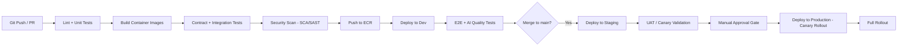

# Deployment Guide
## Enterprise AI Platform — OCIF

**Document 18 of 20** | **Traces to:** Documents 1–17
**Status:** Draft v1.0 — Pending Approval

---

## 1. Purpose

Defines the CI/CD pipeline, environment promotion strategy, infrastructure-as-code approach, and operational runbook for deploying and operating the OCIF platform on AWS/Kubernetes.

---

## 2. CI/CD Pipeline (GitHub Actions)



### 2.1 Pipeline Stages (Detail)

| Stage | Tooling | Gate |
|---|---|---|
| Lint/Unit | pytest, ESLint, mypy | Must pass 100% |
| Build | Docker multi-stage builds | Image size/vulnerability baseline |
| Contract/Integration | Layer-boundary contract tests (Doc 17, Section 3.2) | Must pass 100% |
| Security Scan | SCA (dependency), SAST (code), container image scan | Zero critical/high vulnerabilities |
| Deploy Dev | Helm chart apply to `dev` namespace | Automatic |
| E2E/AI Quality | Full OCIF trace tests + hallucination/grounding suite (Doc 17, Section 3.4) | Must meet defined thresholds |
| Staging Deploy | Helm chart apply to `staging`, production-mirrored config | Automatic on main merge |
| Manual Approval | Release manager + Security Architect sign-off | Required for production |
| Production Canary | 5% traffic shift, automated rollback on error-rate/latency SLO breach | Automatic rollback trigger |

---

## 3. Infrastructure as Code

- **Terraform** manages AWS infrastructure: VPC, EKS cluster, RDS, ElastiCache, MSK, S3, IAM roles, KMS keys.
- **Helm charts** manage per-layer Kubernetes deployments (one chart per OCIF layer namespace, per Document 8, Section 2.1).
- All infrastructure changes go through the same PR + review process as application code (GitOps model).

```
infra/
├── terraform/
│   ├── vpc/
│   ├── eks/
│   ├── rds/
│   ├── elasticache/
│   ├── msk/
│   └── kms/
└── helm/
    ├── perception-capture/
    ├── context-knowledge/
    ├── orchestration-cognition/
    ├── decision-action/
    └── experience/
```

---

## 4. Environment Promotion Strategy

| Environment | Data | Deploy Trigger | Access |
|---|---|---|---|
| Dev | Synthetic | Every PR | Engineering only |
| Staging | De-identified / production-mirrored config | Merge to `main` | Engineering + QA + pilot tenant UAT |
| Production | Live tenant data | Manual approval after staging validation | Restricted, audited access |

---

## 5. Release Strategy

- **Canary releases** for all production deployments: 5% → 25% → 100% traffic shift over a defined observation window, gated on error-rate and latency SLOs (Document 5, Section 8).
- **Feature flags** for gradual feature exposure per tenant (e.g., enabling Workflow Builder for a specific pilot tenant ahead of general availability).
- **Automatic rollback** triggered by SLO breach or elevated Layer 7 `blocked`/error rate during canary window.

---

## 6. Zero-Downtime Migration Patterns

| Scenario | Approach |
|---|---|
| Database schema change | Expand-contract pattern: add new columns/tables first, dual-write, backfill, then remove old schema in a later release |
| Embedding model upgrade | Dual-write re-indexing (Document 11, Section 7), cutover once complete |
| Policy engine rule changes | Versioned policies (Document 14, Section 6), new version activated without downtime, old version retained for audit replay |

---

## 7. Operational Runbook (Summary)

| Scenario | Response |
|---|---|
| LLM provider outage | Automatic fallback to secondary provider (FR-601); alert on-call; monitor cost/quality delta |
| Elevated hallucination-flag rate | Auto-lower auto-approval threshold (fail toward HITL); alert AI quality owner |
| Audit log write failure | Circuit-break action execution (fail-closed — no action without audit, per Document 7 invariant) |
| Tenant isolation alert | Immediate incident response per Document 14, Section 8; affected tenant notified per SLA |

---

## 8. Monitoring & Alerting Thresholds

| Metric | Warning | Critical |
|---|---|---|
| p95 latency | >2.5s | >3s (NFR-01 breach) |
| Error rate | >1% | >5% |
| Layer 7 block rate (unexpected spike) | >20% above baseline | >50% above baseline |
| Audit log write failures | Any occurrence → Critical | — |

---

## 9. Traceability

Operationalizes the deployment topology (Document 8, Section 2.2), HA/DR design (Document 8, Section 5), and testing gates (Document 17) into a repeatable, auditable release process.

---
*End of Deployment Guide*
