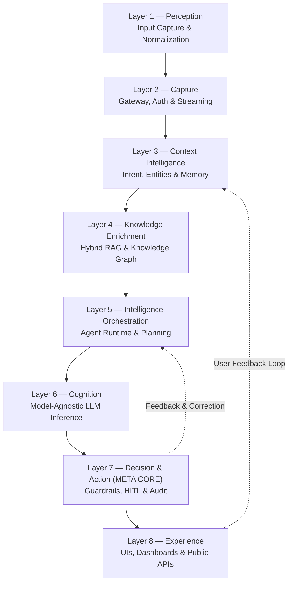

# Project Axiom: Enterprise AI Platform
> Powered by the **Octagonal Cognitive Intelligence Framework (OCIF)**

[](https://fastapi.tiangolo.com/)
[](https://www.python.org/)
[](https://sqlite.org/)
[](https://www.trychroma.com/)
[](#)

Project Axiom is a production-grade, modular, cloud-native Enterprise AI Platform governed by the **Octagonal Cognitive Intelligence Framework (OCIF)**. It acts as a unifying cognitive substrate that integrates conversational user interfaces, copilot widgets, autonomous agent workflows, Retrieval-Augmented Generation (RAG), and complex tool orchestration within a single, secure, non-bypassable decision governance framework.

---

## 1. Architectural Framework (OCIF Layer Model)

Enterprise cognition is structured into eight sequential, composable layers. Every inbound transaction or query traverses this pipeline, ensuring context enrichment, agent orchestration, and safety checking before executing any real-world actions.



### The 8-Layer Cognition Pipeline

| Layer | Responsibility | Key Specs & Subsystems | Source Files |
| :--- | :--- | :--- | :--- |
| **L1: Perception** | Normalizes inbound signals (text, attachments) and filters out immediate threats/spam. | Text input cleansing, document upload parsing, OCR. | [service.py](file:///d:/Tasks/Axiom%20-%20LLM/axiom/layer1_perception/service.py) |
| **L2: Capture** | Handles ingress traffic, security context, rate-limiting, and tenant resolution. | API Gateway routing, OAuth2/JWT token parsing, row-level isolation. | [app.py](file:///d:/Tasks/Axiom%20-%20LLM/axiom/gateway/app.py), [auth_middleware.py](file:///d:/Tasks/Axiom%20-%20LLM/axiom/gateway/auth_middleware.py) |
| **L3: Context** | Establishes identity, classifies request intents, extracts entities, and loads chat memory. | User profile mapping, Redis/SQL memory state tracking, intent classification. | [service.py](file:///d:/Tasks/Axiom%20-%20LLM/axiom/layer3_context/service.py) |
| **L4: Knowledge** | Grounds the request using private company data libraries and databases. | ChromaDB vector search, local Knowledge Graph (KG) retrieval, RRF ranking. | [service.py](file:///d:/Tasks/Axiom%20-%20LLM/axiom/layer4_knowledge/service.py) |
| **L5: Orchestration** | Decomposes goals into stateful multi-agent execution steps and binds registered tools. | Tool registry validation, prompt synthesis, state machine graphs. | [service.py](file:///d:/Tasks/Axiom%20-%20LLM/axiom/layer5_orchestration/service.py) |
| **L6: Cognition** | Translates prompts into structured reasoning outputs using external LLM providers. | Multi-model routing (Gemini, Claude, Llama, OpenAI), confidence scoring. | [service.py](file:///d:/Tasks/Axiom%20-%20LLM/axiom/layer6_cognition/service.py) |
| **L7: Decision** | **META CORE Checkpoint.** Checks outputs against business policies and triggers verification workflows. | Rules-as-code DSL engine, risk evaluation, HITL approval queue, SHA-256 audit ledger. | [service.py](file:///d:/Tasks/Axiom%20-%20LLM/axiom/layer7_decision/service.py) |
| **L8: Experience** | Exposes HTTP routes and delivers the console frontend and chat experience. | Public REST router, static developer console hosting. | [router.py](file:///d:/Tasks/Axiom%20-%20LLM/axiom/layer8_experience/router.py) |

---

## 2. Real Repository Structure

The actual codebase layout corresponds directly to the eight layers of the Octagonal Cognitive Intelligence Framework (OCIF):

```plaintext
axiom/
├── core/                       # Shared system infrastructure & configurations
│   ├── config.py               # Pydantic environment configurations & settings
│   ├── event_bus.py            # Local in-memory asynchronous message broker (Mock Kafka)
│   ├── security.py             # Security utilities: password hashing & JWT generation/verification
│   ├── observability.py        # Structured JSON logger & context propagation utilities
│   └── telemetry.py            # Operational metric collection & aggregation middleware
│
├── storage/                    # Database interface & persistence mechanisms
│   ├── database.py             # SQLite and PostgreSQL connection pools (Sync/Async engines)
│   └── models.py               # SQLAlchemy ORM schemas (Tenants, Policies, AuditLogs, Users)
│
├── gateway/                    # Layer 2 Capture: Secure Ingress Routing
│   ├── app.py                  # Core FastAPI application builder
│   ├── auth_middleware.py      # JWT authentication, role resolver, & request context injector
│   ├── tenant_resolver.py      # Tenant identifier mapping & database level isolation logic
│   └── rate_limiter.py         # Leaky bucket token-based rate limiting per tenant tier
│
├── layer1_perception/          # L1 Perception: Normalization & immediate validation
├── layer3_context/             # L3 Context: Intent classification, entities, & memory retrieval
├── layer4_knowledge/           # L4 Knowledge: ChromaDB retrieval & hybrid search (RRF)
├── layer5_orchestration/       # L5 Orchestration: Task planner, tool registry, & prompt assembler
├── layer6_cognition/           # L6 Cognition: Multi-LLM provider wrappers (Gemini, OpenAI, Claude)
├── layer7_decision/            # L7 Decision: Policy Engine, HITL reviews, & tamper-evident log writing
├── layer8_experience/          # L8 Experience: Public-facing FastAPI routers
│
├── frontend/                   # L8 Experience Frontend console
│   └── index.html              # Premium Glassmorphic Web UI Console
│
├── chunk_engine/               # Text chunking algorithms for document ingestion
├── parser_engine/              # PDF/CSV/Document ingestion parsers
├── embedding_engine/           # local vector embeddings generator (sentence-transformers)
├── vector_engine/              # ChromaDB client connector
└── knowledge_graph/            # Local SQLite-backed knowledge graph connector
```

---

## 3. Technology Stack

Axiom uses a modern, light-weight, cloud-native tech stack optimized for performance, scalability, and strict security compliance:

*   **API Gateway & Server**: [FastAPI](https://fastapi.tiangolo.com/) + [Uvicorn](https://www.uvicorn.org/) (Asynchronous HTTP server runtime)
*   **Database & ORM**: SQLite (`ocif_platform.db` for local dev) / PostgreSQL via [SQLAlchemy 2.0](https://www.sqlalchemy.org/)
*   **Vector Search & RAG**: [ChromaDB](https://www.trychroma.com/) (local vector indexing) and local `sentence-transformers` for embeddings
*   **Configuration & Validation**: [Pydantic v2](https://docs.pydantic.dev/) + `pydantic-settings`
*   **Frontend**: Single Page Application styled with Vanilla CSS (Dark glassmorphism theme) using Google Fonts (Inter, JetBrains Mono)
*   **Audit Compliance**: Tamper-evident ledger entries chained using SHA-256 hashing

---

## 4. Key Platform Features

1.  **Strict Policy Governance Engine (Layer 7)**: Binds a custom Rules-As-Code policy framework. All agent behaviors and outputs must pass through active policy checks. If an agent action carries a high risk score, it is paused and placed in a Human-in-the-Loop approval queue.
2.  **Multitenancy Isolation**: Enforces tenant-based access checks at the gateway layer, isolating relational records (Row-Level Security simulations) and vector namespaces per client tenant.
3.  **Explainable AI & Auditability**: Writes cryptographic ledger entries for each inference cycle. The logs contain raw retrieved documents, prompt inputs, system templates, LLM responses, active policy evaluations, and final decision outcomes.
4.  **Role-Based Access Control (RBAC)**: Supports roles (`platform_admin`, `process_owner`, `compliance_officer`, `end_user`) to control access to operational consoles, approvals, and administrative routes.

---

## 5. Getting Started

### Prerequisites

*   **Python**: Version 3.11 or higher
*   **Git**: Installed and configured

### Install Dependencies

From the project root directory, install all required packages:

```bash
pip install -r axiom/backend/requirements.txt
```

### Running the Application

You can launch the Axiom Platform local development environment using the wrapper script or running Uvicorn directly.

#### Option A: Running via start.bat (Windows)

Double-click on [start.bat](file:///d:/Tasks/Axiom%20-%20LLM/start.bat) or execute it from PowerShell/CMD:

```cmd
.\start.bat
```

Select option `[1]` to initialize the database (if not already initialized) and launch the FastAPI web server. The launcher will automatically open your default browser.

#### Option B: Running via CLI

Launch the Uvicorn application server directly:

```bash
python -m uvicorn axiom.backend.main:app --host 127.0.0.1 --port 8000 --reload
```

The database tables are automatically initialized and seeded with default metadata on startup by [axiom/backend/main.py](file:///d:/Tasks/Axiom%20-%20LLM/axiom/backend/main.py).

---

## 6. Accessing the Platform

Once running, navigate to:

*   **Web Console UI**: [http://127.0.0.1:8000/static/index.html](http://127.0.0.1:8000/static/index.html)
*   **API Docs Swagger UI**: [http://127.0.0.1:8000/docs](http://127.0.0.1:8000/docs)

### Pre-seeded Credentials

Use these credentials to authenticate in the Web Console:

*   **Username**: `admin`
*   **Password**: `admin123`

---

## 7. Documentation Matrix

For deep details, consult the 20-part specifications located in the project root:

1.  **Vision & Requirements**:
    *   [01-Vision-Document.md](file:///d:/Tasks/Axiom%20-%20LLM/01-Vision-Document.md)
    *   [02-Business-Requirements-Document.md](file:///d:/Tasks/Axiom%20-%20LLM/02-Business-Requirements-Document.md)
    *   [03-Product-Requirements-Document.md](file:///d:/Tasks/Axiom%20-%20LLM/03-Product-Requirements-Document.md)
    *   [04-Software-Requirements-Specification.md](file:///d:/Tasks/Axiom%20-%20LLM/04-Software-Requirements-Specification.md)
2.  **Design & Architecture**:
    *   [05-High-Level-Design.md](file:///d:/Tasks/Axiom%20-%20LLM/05-High-Level-Design.md)
    *   [06-Low-Level-Design.md](file:///d:/Tasks/Axiom%20-%20LLM/06-Low-Level-Design.md)
    *   [07-OCIF-Detailed-Specification.md](file:///d:/Tasks/Axiom%20-%20LLM/07-OCIF-Detailed-Specification.md)
    *   [08-System-Architecture.md](file:///d:/Tasks/Axiom%20-%20LLM/08-System-Architecture.md)
    *   [09-Database-Design.md](file:///d:/Tasks/Axiom%20-%20LLM/09-Database-Design.md)
3.  **Module Detailed Design**:
    *   [10-API-Specification.md](file:///d:/Tasks/Axiom%20-%20LLM/10-API-Specification.md)
    *   [11-RAG-Design.md](file:///d:/Tasks/Axiom%20-%20LLM/11-RAG-Design.md)
    *   [12-Prompt-Engineering-Guide.md](file:///d:/Tasks/Axiom%20-%20LLM/12-Prompt-Engineering-Guide.md)
    *   [13-Agent-Design.md](file:///d:/Tasks/Axiom%20-%20LLM/13-Agent-Design.md)
    *   [14-Security-Design.md](file:///d:/Tasks/Axiom%20-%20LLM/14-Security-Design.md)
    *   [15-UI-UX-Design.md](file:///d:/Tasks/Axiom%20-%20LLM/15-UI-UX-Design.md)
4.  **Guides, Strategy, & Deployment**:
    *   [16-Development-Roadmap.md](file:///d:/Tasks/Axiom%20-%20LLM/16-Development-Roadmap.md)
    *   [17-Testing-Strategy.md](file:///d:/Tasks/Axiom%20-%20LLM/17-Testing-Strategy.md)
    *   [18-Deployment-Guide.md](file:///d:/Tasks/Axiom%20-%20LLM/18-Deployment-Guide.md)
    *   [19-User-Manual.md](file:///d:/Tasks/Axiom%20-%20LLM/19-User-Manual.md)
    *   [20-Coding-Prompts.md](file:///d:/Tasks/Axiom%20-%20LLM/20-Coding-Prompts.md)
