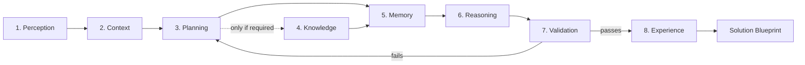

# AXIOM — AI Engineering Solution Visualization Platform
> Internally reasons with the **Octagonal Cognitive Framework (OCIF)**; externally delivers an interactive **Solution Dashboard** — not a chatbot, not a wall of text.

[](https://fastapi.tiangolo.com/)
[](https://www.python.org/)
[](https://sqlite.org/)
[](https://www.docker.com/)
[](#)

AXIOM turns an engineering problem, product idea, or AIoT use case into a complete, production-ready engineering solution — presented primarily as an **interactive dashboard**: a short executive summary, an octagonal navigation map across 8 engineering domains, live diagrams, an implementation roadmap, and a catalog of downloadable enterprise documents (HLD, LLD, BRD, PRD, SRS, OpenAPI, and more) generated on demand from one canonical blueprint. The Octagonal Cognitive Framework that *produces* the solution is entirely internal — normal users only ever see the finished, organized result.

> **This folder (`axiom/`) is the project root.** Run everything from inside it — imports are flat (`api.gateway`, `core.config`, `ocif.kernel`, no `axiom.` prefix). The only things that live one level up, at the true repository root, are `.git/` and `.github/` (GitHub Actions requires workflows at the true repo root).

---

## 1. How AXIOM thinks (internal only)

Every request runs through 8 cognitive engines, each satisfying a uniform Engine Contract (`initialize / execute / validate / shutdown`) and communicating only through a shared `CognitiveContext` and the platform event bus:



| # | Engine | Responsibility |
|---|--------|-----------------|
| 1 | Perception | Normalizes input, screens ingress safety |
| 2 | Context | Intent classification, entity extraction, use-case expansion |
| 3 | Planning | Objectives, requirements, specialist-agent assignment |
| 4 | Knowledge | Optional RAG grounding against ingested documents |
| 5 | Memory | Conversation state + durable "learned from past solutions" recall |
| 6 | Reasoning | The only LLM call site; falls back to a deterministic engineering synthesizer offline |
| 7 | Validation | Fail-closed completeness/consistency checks; scrubs any internal-framework leakage |
| 8 | Experience | Renders the validated Solution Blueprint that everything downstream consumes |

**Developer Mode** (platform admins only, `developer_mode: true` on `/api/v1/solution`) additionally returns the cognitive execution trace, confidence score, and an engine-status octagon SVG — how AXIOM *reasoned*. This is separate from, and never shown alongside, the solution's own octagonal visualization below (which every user gets).

**Learning memory**: every validated solution is persisted (`memory/learning_store.py`, a durable SQLite store) alongside its intent, entities, and trade-offs. Future requests with overlapping entities/intent recall those prior solutions — surfaced to the LLM prompt and folded into the deterministic synthesizer — so AXIOM stays consistent with what it has successfully solved before, across process restarts. Explicit user feedback (`POST /api/v1/feedback`) is recorded the same way.

---

## 2. How the solution is presented (what the user sees)

The finished `SolutionDocument` (the Solution Blueprint) never reaches the user as a raw wall of markdown by default. A second, separate pipeline — which never touches `CognitiveContext` or any internal reasoning frame — re-presents it as a **Solution Dashboard**:

```
Solution Blueprint
  -> Solution Mapping Engine        (classifies content into 8 solution domains)
  -> Octagonal Visualization Engine (SVG / Mermaid / PlantUML / JSON graph / ReactFlow)
  -> Dashboard + Document/Export catalogs
  -> Presentation Package  (the API response)
```

The 8 nodes of this octagon are **solution domains**, not engines — Perception (problem/environment), Context (requirements), Planning (roadmap), Knowledge (tech stack/standards), Memory (architecture/data), Reasoning (solution rationale), Validation (risk/test/security), Experience (deployment/ops). Each node ships real diagrams extracted or derived from the blueprint (architecture flowcharts, ER diagrams, a risk quadrant chart, a technology dependency graph, a system-context diagram from actors) and supports interactive drill-down.

Documents (BRD, PRD, SRS, HLD, LLD, Architecture Doc, API docs, OpenAPI, Deployment Guide, User/Developer Guide, Test Plan, Migration Plan, Support Manual, Runbook) and exports (SVG, Mermaid, PlantUML, JSON graph, ReactFlow, Markdown, JSON, HTML) are **not** eagerly rendered into every response — only lightweight catalogs are, keeping the primary payload small. Full content is rendered on demand via `GET /api/v1/solutions/{id}/documents/{type}` and `GET /api/v1/solutions/{id}/export/{fmt}`. PDF/PNG are declared in the export manifest as unavailable with a clear reason (no rasterizer bundled) — never faked.

---

## 3. Repository layout (enterprise structure — flat, `axiom/` is the root)

```plaintext
axiom/                        <- project root (cd here for everything)
├── ocif/                     # The Octagonal Cognitive Framework — internal reasoning core
│   ├── frames.py             # Engine DTOs, CognitiveContext, SolutionDocument, CognitiveTrace
│   ├── engine.py             # CognitiveEngine — the uniform Engine Contract
│   ├── kernel.py             # OctagonalKernel — executes the 8-engine graph
│   ├── octagon.py            # Engine-status octagon SVG (developer-mode trace, admin-only)
│   ├── domains.py            # Solution-domain taxonomy (the OTHER octagon — public, all users)
│   ├── solution_mapping.py   # Solution Mapping Engine
│   ├── visualization.py      # Octagonal Visualization Engine (SVG/Mermaid/PlantUML/JSON/ReactFlow)
│   ├── blueprint_pipeline.py # Orchestrates mapping -> visualization -> presentation
│   ├── renderers/            # DashboardRenderer, DocumentRenderer (15 doc types), ExportRenderer,
│   │                         # solution_cache (ephemeral, for on-demand rendering), PresentationRenderer
│   └── engines/              # perception, context, planning, knowledge, memory, reasoning, validation, experience
│
├── api/                      # HTTP boundary
│   ├── gateway.py            # FastAPI app factory: middleware, exception handlers, static frontend
│   ├── middleware/           # auth (JWT), tenant isolation, rate limiting
│   └── routes/               # one module per feature: auth, chat, solution, documents, feedback, dashboard, approvals, admin
│
├── inference/                 # LLM provider routing — used only by the Reasoning Engine
├── knowledge/                  # RAG backbone: parser, chunker, embedder, vector store, knowledge graph, ingestion
├── memory/                     # Conversation persistence, session cache, learning_store (durable learning memory)
├── governance/                 # Policy engine, HITL approval queue
├── storage/                    # SQLAlchemy models + async/sync database engines
├── core/                       # Config, security (JWT/RBAC), event bus, exceptions, engine registry
├── frontend/                   # Single-page console (dashboard-first rendering, octagon drill-down, download center)
│
├── docs/
│   ├── specs/                  # Original 20-part vision/requirements/design specification set
│   └── architecture/           # Curated architecture reference docs
│
├── tests/                       # Engine, kernel, mapping/visualization/renderer, and API integration tests
├── data/                        # Runtime SQLite DBs (gitignored)
├── pyproject.toml, setup.cfg, requirements.txt
└── Dockerfile, docker-compose.yml
```

---

## 4. Technology stack

* **API & server**: [FastAPI](https://fastapi.tiangolo.com/) + [Uvicorn](https://www.uvicorn.org/)
* **Database & ORM**: SQLite for local/dev, PostgreSQL-ready via [SQLAlchemy 2.0](https://www.sqlalchemy.org/)
* **LLM inference**: provider-agnostic (Claude, OpenAI, Gemini, local Llama endpoint) with automatic fallback; runs fully offline via a deterministic solution synthesizer when no provider is configured
* **Visualization**: pure-stdlib SVG generation (no plotting dependency), Mermaid, PlantUML, and ReactFlow-compatible JSON — all derived from one canonical blueprint
* **Frontend**: single-file SPA, `marked.js` + `mermaid.js`, dashboard-first rendering with per-domain drill-down
* **Containerization**: multi-stage Docker build, non-root runtime user, `docker-compose` with a persisted data volume

---

## 5. Getting started

### Run locally

From inside this `axiom/` folder:

```bash
pip install -r requirements.txt
python -m uvicorn api.gateway:create_gateway_app --factory --host 127.0.0.1 --port 8000 --reload
```

Or on Windows: `.\start.bat` (run from inside `axiom/`, or double-click it there).

Open **http://127.0.0.1:8000/static/** — the database is created and seeded automatically on startup.

### Run with Docker

From inside this `axiom/` folder (the build context):

```bash
docker compose up --build
```

The app listens on `http://localhost:8000`; data (SQLite DBs + learning memory) persists in the `axiom_data` named volume across restarts.

### Pre-seeded credentials

* **Username**: `admin`
* **Password**: `admin123`

### Key endpoints

| Method | Endpoint | Purpose |
|--------|----------|---------|
| POST | `/api/v1/auth/login` | Authenticate, receive a JWT |
| POST | `/api/v1/chat/messages` | Conversational entrypoint — dashboard + blueprint, or a plain reply |
| POST | `/api/v1/solution` | Full Presentation Package; `developer_mode: true` adds the cognitive trace (admin only) |
| GET | `/api/v1/solutions/{id}/documents` | List available document types for a solution |
| GET | `/api/v1/solutions/{id}/documents/{type}` | Render one document (hld, brd, openapi, ...) on demand |
| GET | `/api/v1/solutions/{id}/export/{fmt}` | Export one format (svg, mermaid, html, json, ...) on demand |
| POST | `/api/v1/feedback` | Rate a response — feeds persistent learning memory |
| GET | `/api/v1/dashboard/usage` | Tenant usage metrics |
| GET/POST | `/api/v1/approvals` | Human-in-the-loop approval queue |

API docs: `http://127.0.0.1:8000/api/docs`

---

## 6. Testing

From inside this `axiom/` folder:

```bash
python -m pytest tests -q
```

Covers Engine Contract compliance for all 8 engines, full kernel execution (fail-closed validation loop, trivial-request short-circuit), the Solution Mapping/Visualization/Renderer pipeline, on-demand document/export endpoints, persistent learning memory across simulated restarts, and API integration — with explicit checks that no internal cognitive-execution vocabulary ever leaks into user-facing output.

---

## 7. Documentation

* [`docs/architecture/`](docs/architecture/) — curated architecture reference (system design, database, API, reasoning/memory/knowledge engine specs)
* [`docs/specs/`](docs/specs/) — original 20-part vision/requirements/design specification set
