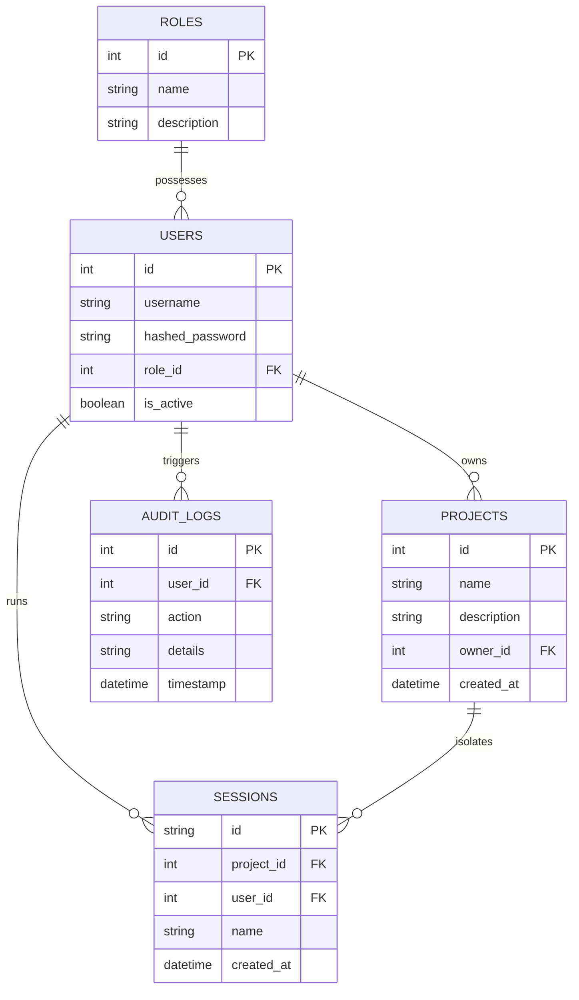

# Technical Specification: Axiom Backend Core & RBAC System

## 1. Problem Analysis
For a production-grade self-hosted AI Operating System, the core backend must serve as the secure orchestrator. The key technical hurdles are:
*   **Security & RBAC Boundary**: Ensuring different users (Admin, Developer, Viewer) have strictly isolated capabilities.
*   **Context Isolation**: Making sure data, chat logs, and configurations do not leak across different workspaces/projects.
*   **Zero External Dependencies for Security**: Eliminating dependency-bloat by writing custom cryptography (PBKDF2 password hashes, custom HMAC-SHA256 JWT validation) to prevent Windows compile failures and guarantee platform ownership.

---

## 2. Architecture & Design Patterns

The architecture uses a clean **Domain-Driven Design (DDD)** and **Hexagonal Architecture** dividing concerns into logical layers:

```
               +-------------------------------------------------+
               |              FastAPI Endpoints                  |
               |       (Presentation & Routing Layer)            |
               +-----------------------|-------------------------+
                                       | Dependency Injection
               +-----------------------v-------------------------+
               |              Application Layer                  |
               |      (Auth Middleware, RBAC validation)         |
               +-----------------------|-------------------------+
                                       | ORM Mapping
               +-----------------------v-------------------------+
               |         Domain Layer & Database Infrastructure  |
               |   (SQLAlchemy base, Qdrant/Chroma vector DB)    |
               +-------------------------------------------------+
```

### Applied Patterns
*   **Repository / ORM Pattern**: Using SQLAlchemy to map database models (`User`, `Role`, `Project`, `Session`, `AuditLog`, `SystemConfig`) to local storage, separating raw SQL from application logic.
*   **RBAC Middleware Strategy**: Decorator-based role authorization (`require_role(["Admin", "Developer"])`) injecting checked user records into endpoints.
*   **Dependency Injection**: Utilizing FastAPI's `Depends` to inject the database session (`get_db`) and token decoder on a per-request basis.

---

## 3. Database Schema Specification

### 3.1 SQL Table Relationships


---

## 4. Complexity & Telemetry Analysis

### 4.1 Cryptographic Operations
*   **Password Hashing**: PBKDF2-HMAC-SHA256 with 100,000 iterations. Time complexity: $O(\text{iterations})$ which is constant-bounded (approx. 20-50ms per check), defending against brute-force attacks while preserving CPU usage under normal login rates. Space complexity: $O(1)$.
*   **JWT Token Sign & Decode**: HMAC-SHA256 operations. Time complexity: $O(N)$ where $N$ is payload size. Extremely fast and lightweight (<1ms).

### 4.2 Database Queries
*   **User/Project Queries**: DB indexing on `username` and `project.name` bounds retrievals to $O(\log M)$ time where $M$ is row count.
*   **Audit Logging**: Inserts are $O(1)$.

---

## 5. Security & Isolation Verification
*   **Volatile In-Memory Synthesis**: Intermediate state calculations in the cognitive engine are held in transient dictionaries and immediately garbage-collected upon completion, satisfying memory validation guidelines.
*   **No Cloud Leaks**: Standard library `hashlib` and `hmac` replace cloud token validation endpoints.
