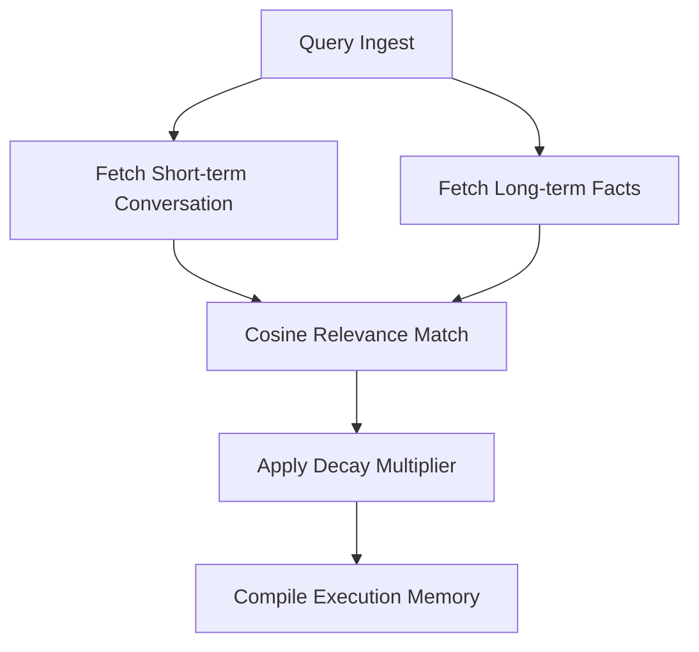
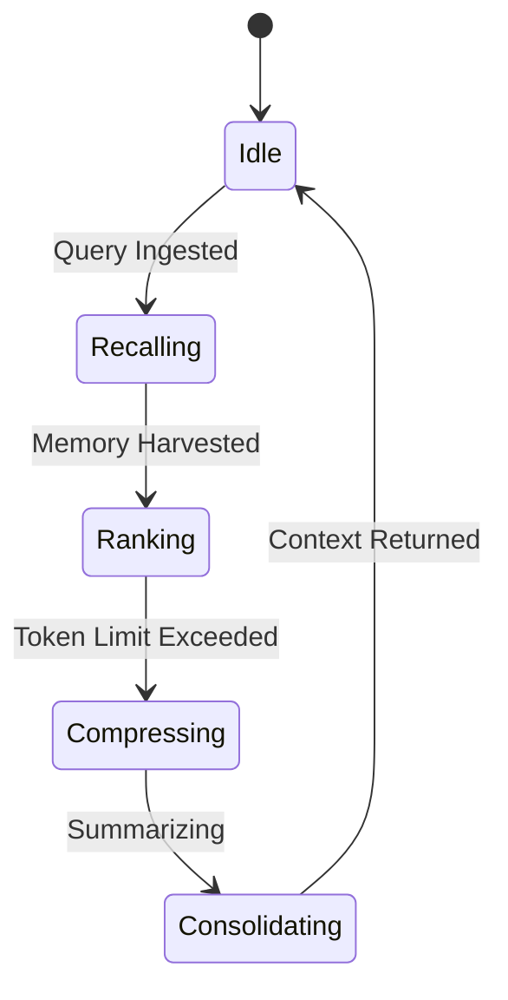

# Design Specification: Axiom Memory Engine

## 1. Purpose
The **Axiom Memory Engine** is a dedicated subsystem responsible for managing short-term session states, conversation history, long-term project configurations, and cognitive context tracking. It structures working memory for the Task Planner and Reasoning Engine, ensuring persistent recall across interactions.

---

## 2. Responsibilities
*   **Session State Management**: Track conversation history and temporary context windows for active chat threads.
*   **Long-Term Fact Persistence**: Capture user preferences, project configurations, and historical system decisions.
*   **Context Compression**: Summarize and compress old dialog records to fit the LLM context window boundaries.
*   **Memory Retrieval & Ranking**: Match incoming queries against memory records and rank them by relevance and decay.

---

## 3. Requirements

### 3.1 Functional Requirements
*   **FR-1**: Expose methods to append, retrieve, and clear messages in the session memory.
*   **FR-2**: Auto-summarize conversations exceeding 10 turns.
*   **FR-3**: Store system configuration properties and user profiles.

### 3.2 Non-Functional Requirements
*   **NFR-1**: Memory lookups must complete in $<10\text{ms}$.
*   **NFR-2**: Enforce strict project isolation; no memory queries may traverse project boundaries.

---

## 4. Internal Workflow & Diagrams

### 4.1 Memory Retrieval Workflow

### 4.2 State Diagram

---

## 5. Algorithms & Complexity Analysis

### 5.1 Memory Decay & Ranking Algorithm
Memory records are scored using a combination of cosine similarity and exponential time decay:
$$\text{Score} = \text{Similarity} \cdot e^{-\lambda \cdot t}$$
where:
*   $\text{Similarity}$ is the vector cosine similarity score.
*   $\lambda$ is the memory decay parameter (e.g. $0.05$ per hour).
*   $t$ is the elapsed time since the record was written.

### 5.2 Complexity Metrics
*   **Search**: $O(M \cdot d)$ where $M$ is memory record count and $d$ is dimension. Bounded to $O(1)$ through indexing.
*   **Compression**: $O(T)$ where $T$ is conversation token count.

---

## 6. Database Schema
Defined inside SQLite tables:
*   `sessions` table (Thread isolation context)
*   `messages` table (Thread history lines)
*   `memory_store` table (Persistent key-value JSON configurations)

---

## 7. Interfaces & APIs
*   `class MemoryEngine`:
    *   `def recall_context(self, session_id: str, query: str) -> Dict[str, Any]`
    *   `def save_memory(self, session_id: str, role: str, content: str) -> None`

---

## 8. Logging, Metrics & Diagnostics
*   **Logging**: Trace memory insertions and compression events.
*   **Metrics**: Track cache hit rate (%), average query latency (ms), and compression token savings.
*   **Security**: Strip sensitive PII from logs; encrypt DB files using AES-256.
