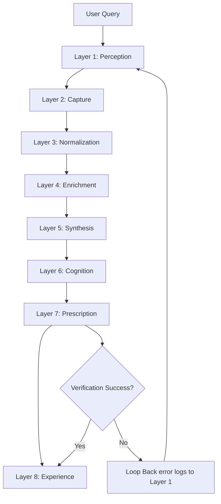
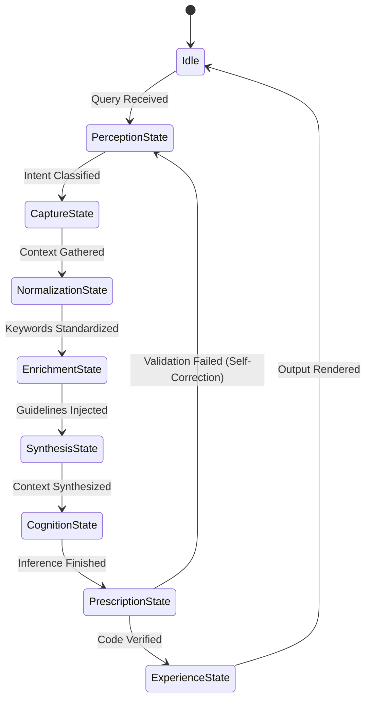

# Design Specification: Axiom Reasoning Engine

## 1. Purpose
The **Axiom Reasoning Engine** is the central intelligence core of the Axiom AI Operating System. Rather than allowing raw user queries to hit the LLM directly, the Reasoning Engine enforces a multi-layered reasoning process (Intent detection $\rightarrow$ Context extraction $\rightarrow$ Policy validation $\rightarrow$ Execution planning $\rightarrow$ Output generation $\rightarrow$ Self-Correction verification).

---

## 2. Responsibilities
*   **Structured Core Reasoning**: Oversee the execution of all cognitive pipeline layers.
*   **Output Validation Guard**: Ensure all generated scripts or schemas are syntactically and security-validated before presentation.
*   **Closed-Loop Correction Loop**: Feed execution sandbox failures directly back into the perception module for auto-healing.

---

## 3. Requirements

### 3.1 Functional Requirements
*   **FR-1**: Execute queries through the full 8-layer Cognitive Pipeline.
*   **FR-2**: Enforce compliance with design standard policies.
*   **FR-3**: Route generated code to the Validation and Execution engines.

### 3.2 Non-Functional Requirements
*   **NFR-1**: Reasoning execution must handle errors gracefully without crashing the pipeline.
*   **NFR-2**: Zero external network API calls during logic validation.

---

## 4. Internal Workflow & Diagrams

### 4.1 System Reasoning Workflow


### 4.2 State Diagram


---

## 5. Algorithms & Complexity Analysis

### 5.1 Self-Correction / Auto-Healing Loop
```python
def execute_reasoning_loop(query, max_retries=3):
    current_query = query
    for attempt in range(max_retries):
        payload = run_pipeline(current_query)
        errors = validation_engine.validate(payload.artifacts)
        if not errors:
            return payload.output
        current_query = format_auto_correct_prompt(query, errors)
    raise ExecutionException("Failed to resolve errors after max attempts")
```

### 5.2 Complexity Metrics
*   **Pipeline Coordination**: $O(L)$ where $L$ is the number of layers (8).
*   **Verification Latency**: $O(V)$ where $V$ is compiler/linter check times ($<50\text{ms}$).

---

## 6. Logging, Metrics & Diagnostics
*   **Logging**: Log pipeline transitions and self-correction iterations.
*   **Metrics**: Track reasoning latency (ms), repair success rate (%), and average correction loops.
*   **Security**: Verify all intermediate synthesis objects exist in-memory and are flushed post-run.
