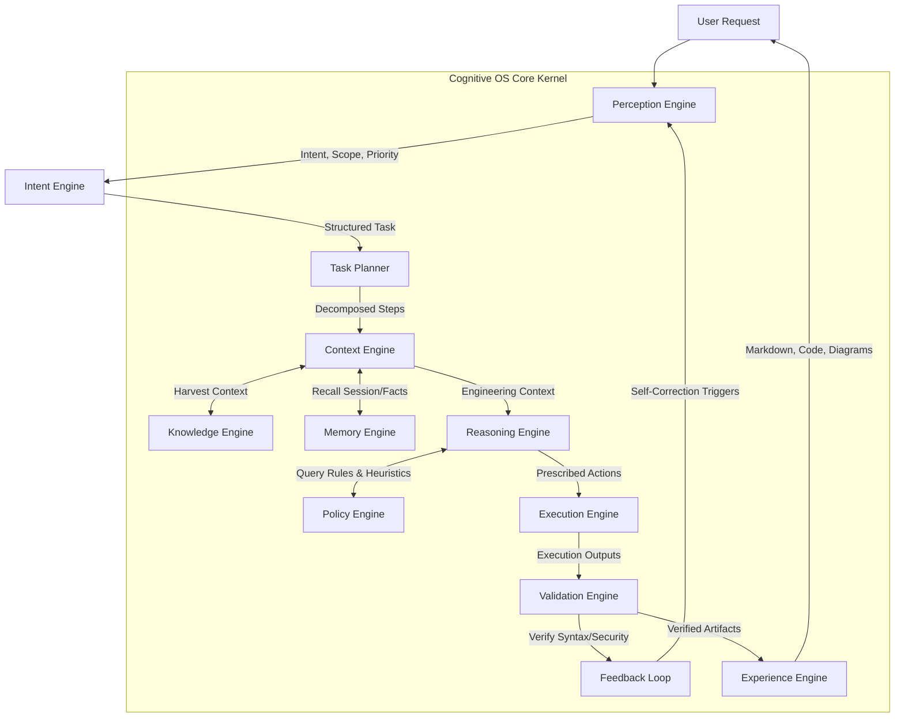

# Architectural Blueprint: AXIOM Cognitive AI Operating System

## 1. System Philosophy & Metaphor
AXIOM is a modular **AI Operating System** composed of independently deployable cognitive engines, knowledge services, memory systems, reasoning pipelines, orchestration workflows, execution services, and pluggable inference providers. The Large Language Model (LLM) is treated as a swappable processing unit (akin to a CPU or GPU), isolated from the state, memory, validation, and execution mechanisms.

---

## 2. Global Cognitive Architecture & Event Flows



---

## 3. Subsystem Specifications

### 3.1 Universal Parsing Framework
1.  **Purpose**: Converts heterogeneous files (PDF, docx, Markdown, Code, Logs, Configurations) into a Unified Document Model.
2.  **Responsibilities**: Extract raw strings, isolate code snippets, structures, tables, and attach file provenance.
3.  **Functional Requirements**: Parse 20+ text/code extensions, output schema compliance, flag parsing error anomalies.
4.  **Non-Functional Requirements**: Parsing latency $<200\text{ms}$ per standard text page; low peak memory footprints.
5.  **Internal Workflow**: File Ingestion $\rightarrow$ Format Detection $\rightarrow$ Strategy Dispatcher $\rightarrow$ Structural Extractor $\rightarrow$ Metadata Annotator $\rightarrow$ Unified Schema Generation.
6.  **Algorithms**: Regex heading detectors, tabular AST parser, AST code classifiers.
7.  **Data Structures**: `UnifiedDocumentModel` schema:
    ```json
    {
      "document_id": "uuid",
      "file_name": "string",
      "sections": [{"title": "string", "elements": [{"type": "code|text|table", "content": "string"}]}],
      "metadata": {"file_type": "string", "version": "string"},
      "confidence": 0.98
    }
    ```
8.  **Interfaces**: `IParserStrategy` declaring `parse(filepath: str) -> UnifiedDocumentModel`.
9.  **APIs**: `POST /api/v1/parser/parse`
10. **Database Schema**: Reference mapping in `knowledge_sources` table.
11. **State Diagram**: `Idle -> Parsing -> ExtractingMetadata -> Validating -> SchemaPublished`.
12. **Sequence Diagram**: User uploads doc $\rightarrow$ API Gateway $\rightarrow$ ParserEngine $\rightarrow$ Strategy Selector $\rightarrow$ File parsing $\rightarrow$ Unified Document Model output.
13. **Component Diagram**: Part of Ingestion Subsystem; feeds Chunker Engine.
14. **Class Diagram**: `ParserEngine` acts as client utilizing polymorphism across `MarkdownParser`, `CodeParser`, `BinaryParser` subclasses.
15. **Error Handling**: Corrupted headers yield `ParseFailureException`; uses fallbacks for raw text stream capture.
16. **Logging**: Level INFO for start/stop, WARNING for parsing warnings, ERROR for parsing failures.
17. **Monitoring Metrics**: Pages parsed per second; failure rate percentages.
18. **Security Considerations**: Blocks XML External Entity (XXE) and zip bomb payloads.
19. **Complexity Analysis**: Time Complexity $O(N)$ where $N$ is file size; Space Complexity $O(N)$ for parsing buffers.
20. **Scalability Strategy**: ThreadPoolExecutor mapping parallel parsing jobs over isolated directories.
21. **Extension Points**: Add custom parser strategies by inheriting from `IParserStrategy`.
22. **Testing Strategy**: Assert output schemas on corrupted, empty, and multi-format files.
23. **Acceptance Criteria**: Formats parsed correctly with confidence scores $>0.90$.
24. **Production Readiness Checklist**: Strict sandbox configuration for parser subprocesses; logging buffers tested.

---

### 3.2 Semantic Chunk Engine
1.  **Purpose**: Divides parsed text streams into semantic, context-aware units rather than raw character partitions.
2.  **Responsibilities**: Detect heading boundaries, tabular frames, and logical code blocks; assign parent-child relations.
3.  **Functional Requirements**: Support sliding semantic windows; tag every chunk with context lineage keys.
4.  **Non-Functional Requirements**: Processing rate $>500$ chunks/sec; no token overflows.
5.  **Internal Workflow**: Raw document feed $\rightarrow$ Boundary Detector $\rightarrow$ Semantic Slicer $\rightarrow$ Metadata Injector $\rightarrow$ Parent-Child Relation Linking $\rightarrow$ Chunk Store publishing.
6.  **Algorithms**: Context window overlap, sliding paragraph boundary scanners.
7.  **Data Structures**: `SemanticChunk` schema:
    ```json
    {
      "chunk_id": "uuid",
      "parent_id": "uuid",
      "heading_path": ["string"],
      "content": "string",
      "keywords": ["string"],
      "relations": [{"target_id": "uuid", "type": "string"}]
    }
    ```
8.  **Interfaces**: `IChunker` exposing `chunk(document: UnifiedDocumentModel) -> List[SemanticChunk]`.
9.  **APIs**: Internal calls only.
10. **Database Schema**: Matches `CHUNK` tables in SQL designs.
11. **State Diagram**: `Buffered -> Scanning Boundaries -> Slicing -> Assigning Relations -> Complete`.
12. **Sequence Diagram**: Parser output $\rightarrow$ ChunkEngine $\rightarrow$ Chunk Slicing $\rightarrow$ Metadata extraction $\rightarrow$ DB Indexer.
13. **Component Diagram**: Sits between Parser Engine and Embedding Engine.
14. **Class Diagram**: `ChunkEngine` coordinates `HeadingChunker`, `TableChunker`, and `CodeChunker`.
15. **Error Handling**: Unstructured blocks default to fixed-size overlaps.
16. **Logging**: Warn on chunks exceeding model token limits.
17. **Monitoring Metrics**: Average chunk size; chunk processing latency (ms).
18. **Security Considerations**: Escapes HTML or executable payloads inside chunks.
19. **Complexity Analysis**: Time Complexity $O(N)$ for linear text scan; Space Complexity $O(N)$ to hold chunk arrays.
20. **Scalability Strategy**: Map-Reduce architecture for chunking large repositories concurrently.
21. **Extension Points**: Register custom boundary detectors (e.g. for proprietary config syntaxes).
22. **Testing Strategy**: Validate parent-child linkage consistency on deep heading structures.
23. **Acceptance Criteria**: No chunk exceeds the maximum token context window limits.
24. **Production Readiness Checklist**: Validate correct indexing of metadata keys.

---

### 3.3 Pluggable Inference Provider Adapter
1.  **Purpose**: Standardizes communication with local or remote inference providers, isolating the AI OS from specific models.
2.  **Responsibilities**: Format incoming prompts to model-specific templates; route calls to vLLM, Ollama, or PyTorch; manage session contexts.
3.  **Functional Requirements**: Support hot-swapping models; parse output signatures; handle rate limits and request retries.
4.  **Non-Functional Requirements**: Time to First Token (TTFT) $<200\text{ms}$; system overhead $<10\text{ms}$.
5.  **Internal Workflow**: Standardized Prompt $\rightarrow$ Adapter Dispatcher $\rightarrow$ Token Template Mapper $\rightarrow$ Endpoint Execution $\rightarrow$ Response Sanitizer $\rightarrow$ Standardized Completion Output.
6.  **Algorithms**: Exponential backoff retry loops, token budget allocations.
7.  **Data Structures**: `ModelCompletionRequest` and `ModelCompletionResponse` schemas.
8.  **Interfaces**: `IInferenceAdapter` declaring `complete(prompt: str, settings: dict) -> str`.
9.  **APIs**: Configurable endpoint configurations.
10. **Database Schema**: System parameter settings in `SystemConfig` table.
11. **State Diagram**: `Ready -> Formatting -> AwaitingInference -> Sanitizing -> Complete`.
12. **Sequence Diagram**: Cognition layer $\rightarrow$ InferenceAdapter $\rightarrow$ Local vLLM/Model Server $\rightarrow$ completion payload.
13. **Component Diagram**: Bounded interface connecting reasoning logic to model execution.
14. **Class Diagram**: `InferenceManager` managing subclasses like `vLLMAdapter`, `OllamaAdapter`, `HuggingFaceAdapter`.
15. **Error Handling**: Catches connection timeouts and falls back to lighter models or error states.
16. **Logging**: Log token output statistics, latency metrics, and API status codes.
17. **Monitoring Metrics**: Latency (ms), Tokens/sec, context lengths.
18. **Security Considerations**: Strict local endpoints (no cloud requests allowed).
19. **Complexity Analysis**: Time Complexity $O(T)$ where $T$ is token length; Space Complexity $O(T)$ for response buffers.
20. **Scalability Strategy**: Load balancer routing requests across multiple model replicas.
21. **Extension Points**: Implement `IInferenceAdapter` to support new model runtimes.
22. **Testing Strategy**: Mock model endpoints and assert prompt mapping formatting.
23. **Acceptance Criteria**: Model swap completes without modifying any cognitive, planning, or execution engines.
24. **Production Readiness Checklist**: Connection limits and token timeouts validated.
