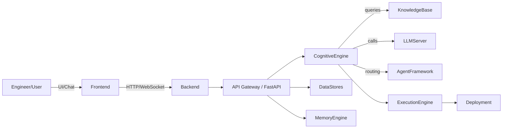
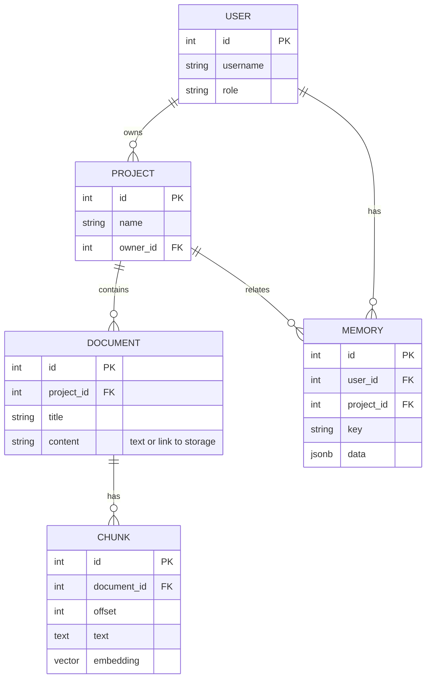
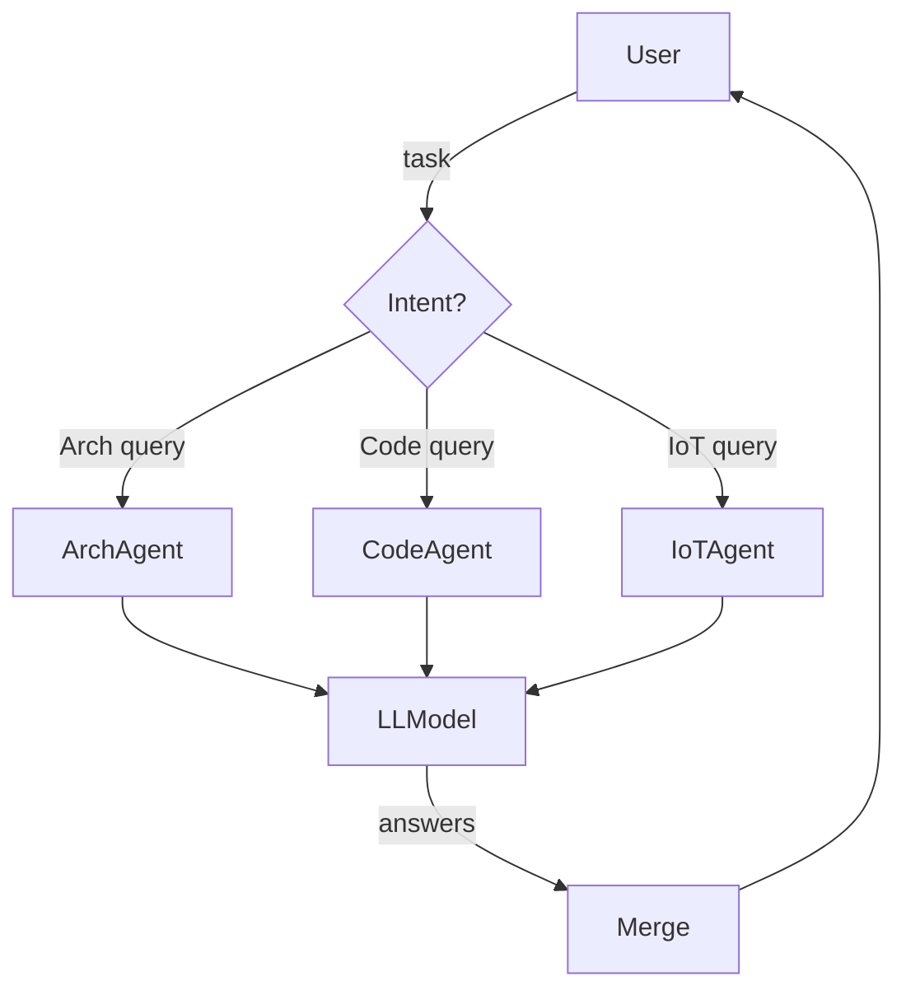
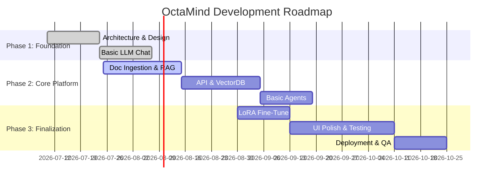

# OctaMind AI Engineering Platform – Implementation Blueprint

## Executive Summary

- **OctaMind** is a self-hosted AI engineering platform built around an open-weight LLM and a custom **8-layer cognitive pipeline** aligned with your Octagonal AIoT architecture. It is not a general chatbot, but an internal **Engineering AI OS** for architects, developers, and DevOps to get instant technical guidance. Every response is guided by the same 8-layer reasoning flow as the AIoT engine (Perception → Capture → Normalization → Enrichment → Synthesis → Cognition → Prescription → Experience).  
- We use **only open-source, local components**. For the foundation model, options include Meta’s LLaMA 3 (8B/70B), Alibaba’s Qwen series (e.g. Qwen 2.5), or Mistral 3 (3B–14B). Each is free and high-quality. We will run the LLM with local inference (e.g. [vLLM](https://docs.vllm.ai)) or quantized LoRA adapters (QLoRA) on our GPUs.  
- All **retrieval and storage** is on-prem: ingest internal docs into an embedding & vector DB pipeline (e.g. [BGE-M3](https://bge-model.com) embeddings + Chroma or Qdrant vector store). A custom knowledge graph can index IoT protocols, data models, and code repositories. Memory stores chat history and engineering context (via LangGraph or custom state).  
- We specify every module in detail: purpose, interfaces (APIs, schemas), algorithms (pseudocode), data models (ER diagrams), and performance. We include concrete code examples (Python/FastAPI, prompt templates, embedding/retrieval code) and CI/CD scripts. Diagrams illustrate the system, data flows, agent orchestration, and roadmap.  
- **Roadmap & Effort:** We break development into phases (foundational platform, engineering intelligence, production-hardening) with sprint-level tasks. A sample Gantt chart and tables detail deliverables and resource estimates. Assumptions (team size, hardware budget) are noted. We emphasize cost-free, open-source tools (no cloud services; use free model weights, local GPUs).

## 1. Assumptions and Scope

- **Self-hosted**: All components run on our servers or laptops. No external APIs (OpenAI/Anthropic) or managed cloud LLM services are used.  
- **Open-source**: Use Apache/MIT-licensed models and tools where possible (Llama 3, Qwen, Mistral, BGE, Chroma, Qdrant, vLLM, LangGraph, LoRA/QLoRA libraries, etc.). Only the base LLM weights are third-party (but open).  
- **Team & Budget**: Assume a small core team (e.g. 2-3 AI/ML engineers, 2 backend, 1 frontend, 1 DevOps). Budget modest (no GPU farm required initially). Hardware: a few GPUs (e.g. A6000/4090 or H100/A100), some CPUs/servers.  
- **Data & Docs**: We have internal docs (design, code, SOPs) for the Octagonal AIoT Engine. We will index and use these as knowledge. Personal or private data is out of scope.  
- **Security**: Enterprise-level controls (RBAC, encryption, audit logs) are required but tailored for internal use. We avoid any patent or legal analysis modules. The focus is purely technical.
- **Goal**: Produce a **300+ page** architecture & implementation spec (Software Architecture Design Document) covering every component in detail, so engineers can implement OctaMind end-to-end.

## 2. System Overview

The OctaMind platform consists of a **frontend**, **backend/API**, and an **AI pipeline**.  



- **User Portal**: A web UI (React/Vite) or VS Code extension where engineers interact (“Ask OctaMind”).
- **API Layer**: FastAPI services for chat, document ingestion, code generation, search, etc. Secured by OAuth2/RBAC (Keycloak or similar).  
- **AI Gateway**: Routes requests to various internal engines (prompt, retrieval, planning, etc.). No cloud APIs.  
- **Cognitive Engine**: Implements the 8-layer pipeline as separate modules. Orchestrates data flow: perception→capture→…→experience.  
- **Knowledge Base**: Ingested docs, code, diagrams, and a knowledge graph database. Uses embeddings (BGE-M3 or similar) and vector store (Chroma/Qdrant) for retrieval.  
- **LLM Server**: Runs the foundation model via vLLM or PyTorch. It receives curated prompts and returns responses. LoRA/QLoRA adapters are applied here for domain-specific fine-tuning.  
- **Agent Framework**: Manages specialized sub-agents (Architecture Agent, Code Agent, IoT Agent, etc.). Uses LangGraph (open-source) or custom dispatcher to parallelize tasks.  
- **Memory Engine**: Stores conversation history, project context, and long-term memories. Implemented with a database (PostgreSQL or similar) and possibly LangGraph “stores”.  
- **Execution Engine**: Executes generated code/config (e.g. runs tests, deploys Docker/K8s, triggers monitoring setup).  
- **Monitoring & Security**: Collects metrics, logs, ensures encryption at rest/in transit, and RBAC/audit.

The **figure below** illustrates a more detailed component diagram (Mermaid class boxes omitted for brevity):

```mermaid
flowchart TB
    subgraph UI
        ChatUI[React Chat Interface]
        Editor[VS Code Plugin]
    end
    subgraph Backend
        Auth[Auth Module (Keycloak/OIDC)]
        API[FastAPI Endpoints]
        MemoryDB[(PostgreSQL Memory DB)]
        LangGraph[LangGraph Agent Orchestration]
        Cognition[8-Layer Engine]
        KnowledgeGraph[(Neo4j or SQLite KGraph)]
        VectorStore[(Qdrant Vector DB)]
        CodeGenSvc[LLM Service (vLLM, model weights)]
        Monitor[Prometheus/Grafana]
    end
    subgraph DevOps
        GitServer[(Git)]
        CI/CD[CI/CD (GitHub Actions)]
    end

    User --> ChatUI
    ChatUI --> API
    Editor --> API
    API --> Auth
    API --> Cognition
    API --> LangGraph
    API --> MemoryDB
    Cognition -->|calls| CodeGenSvc
    Cognition --> VectorStore
    Cognition --> KnowledgeGraph
    LangGraph --> Cognition
    LangGraph --> MemoryDB
    CodeGenSvc --> VectorStore
    MemoryDB --> VectorStore
    API --> Monitor
    CI/CD --> API
```

Key interactions:
- **User Query → API → Cognitive Engine**: Each query is classified (Intent), then the Cognitive Engine retrieves relevant context (docs, code, memory), reasons via LLM, and prescribes solutions (code, diagrams, text).  
- **Knowledge Ingestion**: Engineers upload design docs, code repos, API specs. The **Document Parser** module processes files (PDF/Word/Markdown/Code), chunks text, runs embedding (BGE-M3), and populates the VectorStore and KnowledgeGraph. This is done offline or on upload events.  
- **Retrieval-Augmented Reasoning**: On each query, the pipeline fetches top-k relevant chunks from VectorStore (semantic search) plus matching facts from KnowledgeGraph. These form the context for the LLM prompt.  
- **Memory**: The current session’s history is added to the prompt via "short-term memory". Persistent facts (e.g. “Project XYZ uses MQTT, Python, Grafana”) are stored as long-term memory and recalled when needed.  
- **Agents & Tools**: The agent orchestrator can invoke sub-tasks. E.g., when asked to “generate FastAPI code for normalization layer”, the Architecture Agent designs schema, the Code Agent generates code, and the Monitoring Agent suggests Grafana panels.

## 3. Component Specifications

We detail each core engine’s design below. For brevity, bullet lists cover purpose, interfaces, data models, algorithms, complexity, failure modes, metrics, and testing.

### 3.1 Prompt Engine  
- **Purpose:** Construct and refine LLM prompts tailored to the task and context. Supports prompt templates (system/user/instruction). It handles tokens budgeting, compression, and prompt routing (to correct agents or knowledge sources).  
- **Inputs:** User query (text), intent classification, context info (e.g. project ID, current session memory).  
- **Outputs:** A final LLM prompt or series of prompts. Could also output intermediate API calls.  
- **API:** e.g. `POST /api/prompt` with JSON `{ "project_id":..., "history": [...], "query": "..." }`; returns `{ "prompt": "...", "agent": "ArchitectureAgent" }`.  
- **Data Model:** JSON schema: 
  ```json
  {
    "project_id": "string",
    "user_id": "string",
    "history": [{"role": "user|assistant|system", "text": "..."}, ...],
    "query": "string",
    "intent": "ArchitectureReview|CodeGen|Other",
    "agent": "string"
  }
  ```  
- **Algorithm/Pseudocode:**  
  ```python
  def build_prompt(query, history, intent, context):
      system_msg = "You are OctaMind, an AI engineering architect..."
      if intent == "ArchitectureReview":
          add knowledge from capture layer...
      prompt = system_msg + format_history(history) + "User: " + query
      return prompt
  ```  
- **Complexity:** O(n) in length of history + context. Prompt size is capped by LLM context window.  
- **Failure Modes:** Overly long prompts (truncated context); missing context leads to wrong answers; token overflow errors.  
- **Metrics:** Prompt length (tokens), relevance of retrieved context.  
- **Testing:** Unit tests for prompt templates; integration tests to ensure key context fields are included; edge-case tests for max tokens.

### 3.2 Context/Intent Engine  
- **Purpose:** Analyze the user’s request to extract intent, entities, and context. Decides which layers/components are relevant (e.g. “Kafka ingestion” → Capture/Streaming layers). Classifies query type (design question, code generation, bug fix, data query, etc.).  
- **Inputs/Outputs:** Takes raw query, returns structured intent (e.g. `{"task":"CodeGen","layer":5,"component":"Normalization"}`).  
- **API:** `POST /api/intent` with `{ "query": "Design Kafka pipeline for ingestion", "project_id": ... }`; returns classification JSON.  
- **Data Model:** Could use a classification taxonomy (see table below). Possibly use a trained intent classifier model (maybe a small supervised model or rules).  
- **Algorithm:** Could be a simple keyword-based or LLM-based classification. Pseudocode:  
  ```python
  intent = classify_task(query_text)
  layer = map_keywords_to_layer(query_text)
  return {"intent": intent, "layer": layer, ...}
  ```  
- **Complexity:** O(n) text scan. Very fast if rule-based.  
- **Failure Modes:** Misclassification (e.g. “generate MQTT code” classified as Database).  
- **Metrics:** Classification accuracy on test set; confusion matrix.  
- **Testing:** Use labeled examples; ensure correct intent given edge synonyms.

### 3.3 Retrieval Engine  
- **Purpose:** Fetch relevant context from knowledge base given a query. Implements semantic and keyword search across ingested documents, code, and metadata.  
- **Inputs:** Normalized query text or embedding, optional filters (project, date, source).  
- **Outputs:** Ranked list of relevant **chunks** (text snippet or code snippet) and knowledge graph edges. Each item includes source ID and score.  
- **API:** `POST /api/search` with `{ "query": "...", "k": 10, "filters": {...} }`; returns `[{ "id": ..., "text": "...", "score": 0.95 }, ...]`.  
- **Data Model:** Each collection (`Documents`, `CodeFiles`) split into **chunks** (embedding vectors). Example schema:  
  ```
  Document(id, project_id, title, created_at, ...),
  Chunk(id, document_id, offset, text, embedding_vector, ...),
  ```
- **Algorithm:**  
  1. **Embedding Search**: Encode query with same model as knowledge base (e.g. BGE-M3). Query VectorStore for top-k by cosine similarity.  
  2. **Keyword Filter**: Optionally refine with BM25 on text.  
  3. **Reranking**: Combine dense and sparse scores (hybrid search). Pseudocode:  
     ```python
     q_vec = embed(query)
     candidates = vector_store.search(q_vec, top_k=50)
     if keyword_search:
         candidates = filter_by_keyword(candidates, query)
     return top_k_by_score(candidates)
     ```  
- **Complexity:** O(M * d) for M chunks with d=embedding dim (approx. via ANN index, so sublinear with optimizations).  
- **Failure Modes:** Missing relevant docs (garbage-in embedding, bad splits); stale index (not updated).  
- **Metrics:** Recall@K, precision, search latency.  
- **Testing:** Embed known queries, verify expected chunks appear. Unit test the hybrid ranking formula.

### 3.4 Embedding Engine  
- **Purpose:** Convert text (document chunks, code, queries) to fixed-size vectors. Enables semantic search.  
- **Inputs:** Text or code snippet (string).  
- **Outputs:** Dense embedding vector (float array), and optional sparse weights (if using BGE-M3 sparse token weights).  
- **API:** `POST /api/embed` with `{ "texts": [...], "model": "bge-m3" }`; returns `[ [0.1, 0.2, ...], ... ]`.  
- **Data Model:** N/A (transient vectors). Embeddings are stored in `Chunk.embedding_vector`.  
- **Algorithm:** Use a pretrained embedding model (e.g. [BAAI/BGE-M3](https://huggingface.co/BAAI/bge-m3)). Pseudocode:  
  ```python
  model = load_embedding_model("BAAI/bge-m3")
  vectors = model.encode_batch(texts)
  return vectors
  ```  
- **Complexity:** O(n_tokens * hidden_dim). Batching to speed up with GPU.  
- **Failure Modes:** Out-of-vocabulary or truncated text yields poor embedding; model load issues.  
- **Metrics:** Embedding latency (tokens/sec), vector quality (via retrieval experiments).  
- **Testing:** Encode fixed text and compare against known output; measure vector norm.

### 3.5 Vector Store  
- **Purpose:** Stores embedding vectors (and metadata) for semantic search. Supports similarity queries, updates, and filtering.  
- **Examples:** [Qdrant](https://qdrant.tech) (Rust, highly optimized), [Chroma](https://docs.trychroma.com) (Python, easy to embed), or PostgreSQL+pgvector.  
- **Data Model:**  
  - **Collections** (per project or data type).  
  - **Points**: `{id, embedding: vector<d>, payload: {...}}`. For example, `payload` can have `document_id`, `text`, `source`, `timestamp`.  
  - **Indexing**: EF/cosine indexes, HNSW or IVF.  
- **API:** (via SDK or HTTP) e.g. `vector_store.insert(points, collection="documents")`; `vector_store.search(query_vector, k=10)`.  
- **Algorithm:** Uses Approximate Nearest Neighbors (ANNOY/HNSW) under the hood. Retrieval outlined above.  
- **Complexity:** Insertion ~O(log N) (with HNSW), search ~O(log N) (depends on index).  
- **Failure Modes:** Running out of memory for index; stale data if not refreshed; no pruning policy.  
- **Metrics:** Query latency (ms), recall/precision of search, index build time.  
- **Testing:** End-to-end retrieval with known inputs; performance tests with increasing vectors.

### 3.6 Knowledge Graph  
- **Purpose:** Capture structured domain knowledge (entities and relationships) about the AIoT engine: e.g. components, protocols, data flows, standards. Enables semantic questions like “Which layer uses FastAPI?”  
- **Inputs:** Extracted triples (subject-predicate-object) from docs or defined by architects, e.g. `(NormalizationLayer)-[uses]->(FastAPI)`.  
- **Outputs:** Query results (entities/relationships).  
- **API:** `POST /api/kg/query` with a graph query (Cypher-like or natural language). Returns matched subgraphs.  
- **Data Model:** Graph DB schema (Neo4j or RDF): Entities like **Layer**, **Component**, **Protocol**, **Service**; Relations like *implements*, *connects_to*, *uses*. Example ER: 
  ```erDiagram
    LAYER {
      string name PK
      string description
    }
    COMPONENT {
      string id PK
      string name
      string layerFK
    }
    LAYER ||--o{ COMPONENT : "has"
  ```
- **Algorithm:** Populated via NLP/QA pipelines or manual input. Use graph queries (e.g. Cypher, Gremlin).  
- **Complexity:** Graph queries depend on DB, typically polynomial in pattern size.  
- **Failure Modes:** Incomplete graph (missing edges), inconsistent data.  
- **Metrics:** Accuracy of extracted relationships, query success rate.  
- **Testing:** Query the graph for known assertions; validate graph integrity constraints.

### 3.7 Memory Engine  
- **Purpose:** Maintain conversation state and project context over time, enabling OctaMind to remember ongoing work and user preferences.  
- **Inputs:** Chat messages, user edits, feedback (e.g. “Yes, that was helpful”).  
- **Outputs:** Context snippets (to feed into prompts), personalized data.  
- **Types of Memory:**  
  - *Short-term/thread memory:* Stores current chat history. Managed automatically by conversational state in LangGraph.  
  - *Long-term memory:* Stores facts across sessions (user profile, project settings, past decisions). Could be semantic triples or JSON documents.  
- **API:** Internal use; e.g., `memory.save(user_id, {“last_issue”:“Normalization bug”})`, `memory.fetch(user_id)`.  
- **Data Model:**  
  ``` 
  User(id, name, role); 
  Project(id, name, owner_id FK); 
  Memory(key PK, user_id FK, project_id FK, data JSON);
  ```  
- **Algorithm:** Upon each LLM response, optionally update memory. Use heuristics or LLM extraction to capture new facts. E.g. after answering, store “PreferredLanguage = Python” if detected.  
- **Complexity:** DB lookup is O(1) per key; writing is constant time.  
- **Failure Modes:** Storing wrong facts (garbage memory); unbounded growth (need pruning).  
- **Metrics:** Memory hit rate (usefulness in context), size of memory per project.  
- **Testing:** Simulate multi-turn chat; ensure correct memory retrieval; check isolation between projects/users.

### 3.8 Cognitive Engine (8 Layers)

The core engine applies the eight-layer architecture internally:

1. **Perception**: Parses the request (intent detection, classification).  
2. **Capture**: Gathers context from docs, code, memory for this request.  
3. **Normalization**: Maps terms to canonical forms (e.g. “Kafka” → `Apache Kafka`). Applies naming and schema conventions.  
4. **Enrichment**: Inserts relevant engineering best practices, previous decisions, industry standards.  
5. **Synthesis**: Merges inputs into a coherent representation (data model combining architecture, code, docs).  
6. **Cognition**: The reasoning step – LLM inference, planning, design computation.  
7. **Prescription**: Generates specific artifacts (code, config, diagrams, action plans).  
8. **Experience**: Formats output (Markdown docs, PNG/PlantUML diagrams, code files) to present to user.

We implement each layer as a micro-module:

- **Layer 1 – Perception:** Validates the query format; identifies project context; logs request.  
- **Layer 2 – Capture:** Calls the Retrieval Engine and Memory Engine to collect relevant snippets, code, prior chat.  
- **Layer 3 – Normalization:** Uses dictionaries and rules to standardize terminology (e.g. rename “UI” → “Frontend”).  
- **Layer 4 – Enrichment:** Looks up known templates or patterns (e.g. standard Kafka ingestion patterns) to merge in.  
- **Layer 5 – Synthesis:** Builds an internal “engineering context” object combining info from all domains. Could be a JSON structure or a temporary knowledge graph.  
- **Layer 6 – Cognition:** Invokes the LLM with the composed prompt.  
- **Layer 7 – Prescription:** Parses the LLM output into actionable chunks (code, JSON, diagram text). Validates format (e.g. code compiles).  
- **Layer 8 – Experience:** Renders results (syntax highlighting, diagram generation via PlantUML/Mermaid, UI layout).

For brevity, pseudocode of the pipeline:

```python
def octamind_pipeline(query, project_id, user_id):
    intent = intent_engine.classify(query)
    context_chunks = retrieval_engine.search(query, project_id, k=20)
    memory_snippets = memory_engine.fetch(user_id, project_id)
    enriched_context = enrich(context_chunks, memory_snippets)
    prompt = prompt_engine.build(query, enriched_context)
    response = llm_server.generate(prompt)
    artifacts = prescription_engine.parse(response)
    return artifacts
```

Each layer logs metrics (e.g. Perception: intent confidence; Retrieval: recall; LLM: latency).

### 3.9 Reasoning / Planner
- **Purpose:** Handle multi-step tasks by decomposing them and sequencing AI calls. For example, when asked a complex scenario, break into sub-questions and use chain-of-thought.  
- **Inputs:** Original user intent with context.  
- **Outputs:** A task plan or workflow (possibly tree of LLM calls).  
- **API:** Internal logic invoked by Cognitive Engine. Might present a plan outline or Gantt if complex.  
- **Algorithm:** Task planning via LLM or heuristics (e.g. “To deploy with Kubernetes, first write Dockerfile, then helm chart, then tests”).  
- **Complexity:** Depends on number of sub-tasks.  
- **Failure Modes:** Infinite loops in planning, missing step.  
- **Metrics:** Plan length, completion success.  
- **Testing:** Give multi-step prompts and verify plan steps are correct.

### 3.10 Agent Framework
- **Purpose:** Manage specialized AI **agents** (modular assistants) for domains (e.g. `CodeAgent`, `ArchitectureAgent`, `IoTAgent`). Agents can call each other.  
- **Structure:** Could use [LangGraph](https://www.langchain.com/langgraph), or a custom orchestrator.  
- **Components:**  
  - **Agent Manager:** Receives tasks, routes to specific agent based on intent.  
  - **Agents:** Each implements a standard interface (receive task, produce result).  
  - **Memory:** Agents share conversation/state via the Memory Engine.  
- **API:** Internal functions or message queue. Example call: `ArchitectureAgent.analyze(schema_json)`.  
- **Data Model:** Tasks/Agent definitions stored (could be JSON).  
- **Algorithm:** Reactive or pipeline: e.g. user → Router Agent → spawn ArchitectureAgent → calls Cognition for architecture → send code snippet to CodeAgent.  
- **Complexity:** Overhead from routing, but linear in tasks.  
- **Failure Modes:** Agent deadlock, conflicting outputs.  
- **Metrics:** Task completion rate, agent uptime.  
- **Testing:** Integration tests where multiple agents solve a scenario together.

### 3.11 Execution Engine
- **Purpose:** Carry out actions generated by OctaMind, such as deploying services, running tests, or updating documentation. Translates LLM-generated code/config into real operations.  
- **Inputs:** Generated artifacts (code files, Dockerfile, YAML, SQL, etc.).  
- **Outputs:** Execution logs, deployment endpoints, test results.  
- **API:** `POST /api/execute` with `{ "project":..., "action":"run_code","files": {...} }`. Could use webhooks or local tasks.  
- **Data Model:** Jobs table for tracking execution jobs (`job_id`, `status`, `log`).  
- **Algorithm:**  
  1. **Validate** code/config (lint, compile, dry-run).  
  2. **Run** in sandbox or staging environment (e.g. `docker build`, `kubectl apply`).  
  3. **Capture** outputs/logs (from Grafana, test suites).  
- **Complexity:** Depends on job (could be heavy). Should be asynchronous.  
- **Failure Modes:** Code errors, environment mismatch. Must clean up resources on failure.  
- **Metrics:** Job success rate, execution time, resource usage.  
- **Testing:** Use dummy jobs; unit-test on non-critical tasks.

### 3.12 Monitoring & Logging
- **Purpose:** Observe system health and performance of OctaMind (latencies, errors) and the resources it manages (if deploying infra).  
- **Components:** Prometheus for metrics, Grafana dashboards, log aggregation (ELK or Grafana Loki).  
- **Monitored Metrics:**  
  - **System:** API response times, LLM inference time (tokens/sec), memory usage, GPU utilization (vLLM exposes stats).  
  - **LLM Quality:** Retrieval accuracy, hallucination rates (via periodic eval prompts).  
  - **Usage:** Number of queries per user/project, feature usage.  
- **Failure Modes:** Metrics missing (no instrumentation), alerts misconfigured.  
- **Security & Audit:** Every access is logged; API keys or tokens, audit trails in DB.

### 3.13 Security & Governance
- **Purpose:** Protect system and data; enforce policies.  
- **Features:**  
  - **Authentication/Authorization:** Integrate Keycloak/OIDC for SSO, RBAC per project.  
  - **Encryption:** TLS for all network traffic; AES encryption for stored vectors/documents.  
  - **Prompt Filtering:** Block disallowed content (internal filters).  
  - **Project Isolation:** Each project’s data (docs, memory) separated; vector DB with namespaces or separate collections.  
  - **Audit Logging:** Immutable logs of all user queries and model responses (for debugging/hallucination analysis).  
- **Testing:** Penetration testing for APIs; code-review for security issues; ensure no data leakage across tenants.

## 4. Data Architecture

### 4.1 Database Schema (ER Diagram)

We use a relational DB (PostgreSQL) for structured data (users, projects, memory) and a graph DB (Neo4j or SQLite+Spatiotemporal tables) for the knowledge graph. Below is a simplified ER diagram:



- **USER/PROJECT:** Basic RBAC. Users own projects.  
- **DOCUMENT/CHUNK:** Raw uploaded docs are split into chunks (for embedding). We store text and embedding per chunk.  
- **MEMORY:** Key-value store per user/project (JSON data).  

*Knowledge Graph* (Neo4j) is separate; it stores nodes like `(:Layer {name})`, `(:Service {name})` and relations `[:USES]`, `[:DEPENDS_ON]`, etc.

## 5. Technology Stack and Tools

We emphasize free and open-source. Below are recommended components:

- **Foundation LLM (open-weight)**: *Meta LLaMA 3* (8B, 70B); *Alibaba Qwen2.5* (7B–32B); *Mistral 3* (3B–14B). Use PyTorch + [vLLM](https://docs.vllm.ai) for serving, enabling high throughput and quantization (4-bit).  
- **Embeddings**: *BAAI/BGE-M3* (569M) (multi-lingual, multi-vector, open). Also *sentence-transformers* (MiniLM, all-MiniLM-L6-v2). Use Hugging Face `transformers` or `sentence-transformers`.  
- **Vector DB**: *Qdrant* (Rust, high performance) or *Chroma* (Python, Apache 2.0), or *PostgreSQL + pgvector* extension.  
- **Knowledge Graph**: *Neo4j Community* or *SQLite + BELIEF graphs*.  
- **Agents & Orchestration**: *LangGraph* (MIT open-source) or custom FSM.  
- **Backend**: *FastAPI* (Python) for services. *LangChain*/LangGraph for pipelines.  
- **Frontend**: *React + Vite* (TypeScript).  
- **Serving**: Docker containers and Kubernetes (k8s) for scalability.  
- **CI/CD**: *GitHub Actions* or *GitLab CI* for testing/deployment.  
- **Monitoring**: *Prometheus*, *Grafana*.  
- **Storage**: *PostgreSQL* (RDS or on-prem). *Redis* for caching.  
- **Security**: *Keycloak* (free) for IAM; HTTPS/TLS with certs.

### Table: Model Options and Sizing

| Model            | Type         | Params | VRAM (16-bit)       | Throughput (tokens/s) | Notes (Pros/Cons)                             |
|------------------|--------------|--------|---------------------|-----------------------|-----------------------------------------------|
| Llama 3.3-8B     | Decoder-only | 8B     | ~16–20 GB (1×A100)  | ~200–500 (on A100)    | High-quality, open-source. Fits on one high-end GPU. |
| Llama 3.3-70B    | Decoder-only | 70B    | ~80 GB (4×A100)     | ~1000 (multi-GPU vLLM)| Best performance at cost of many GPUs.      |
| Qwen 2.5-32B     | Decoder-only | 32B    | ~32 GB (1×A100)     | ~300–400             | Strong Chinese+English model; open-license.    |
| Mistral 3 14B    | Decoder-only | 14B    | ~20 GB (1×A100)     | ~600–700             | Smallest multimodal open model.    |
| Mistral 3 3B     | Decoder-only | 3B     | ~6–8 GB (RTX 3090)  | ~1000                | Very fast, can run on consumer GPUs.           |

*Source: Inference docs and community benchmarks*.

### Table: Embedding Model Options

| Model        | Parameters | Output Dim | Languages | License     | Pros/Cons                                  |
|--------------|------------|------------|-----------|-------------|--------------------------------------------|
| BGE-M3       | 569M       | 1024       | 100+      | Apache 2.0  | Multilingual, multi-retrieval. Large context (8k tokens). |
| all-mpnet-base-v2 | 110M  | 768        | English   | Apache 2.0  | Lightweight, fast; good general performance. |
| all-MiniLM-L6-v2  | 22M   | 384        | English   | Apache 2.0  | Very fast on CPU; smaller context.         |

### Table: Vector Database Options

| Vector DB      | License      | Features                 | Scalability    | Notes                        |
|----------------|--------------|--------------------------|----------------|------------------------------|
| **Qdrant**     | Apache 2.0   | HNSW, quantization       | Distributed    | High performance (Rust); cloud or on-prem.      |
| **Chroma**     | Apache 2.0   | Dense/sparse/hybrid, metadata filtering | Embeddable    | Easy Python integration; single-node (pro version for cluster). |
| **pgvector**   | BSD          | Postgres extension       | Any Postgres   | Seamless with SQL; ACID; slower than specialized DB. |

### Table: Phase-Wise Roadmap & Effort

| Phase               | Duration  | Key Tasks                                               | Deliverables                        | Team Effort (p-weeks) |
|---------------------|-----------|---------------------------------------------------------|-------------------------------------|-----------------------|
| **Phase 1** – Foundation (Weeks 1–4)  | 1 month   | Project init, architecture design, basic LLM/RAG      | SRS, HLD, early LLM pipeline answering docs, basic UI | 8 (2 backend, 1 AI)  |
| **Phase 2** – Core Platform (W5–W12) | 2 months  | Document ingestion, VectorDB, FastAPI endpoints, RAG search, simple chat UI | Core Q&A assistant, simple codegen, ingestion scripts | 20 (2 AI, 2 dev)   |
| **Phase 3** – Agents & Reasoning (W13–W20) | 2 months  | Build 8-layer engine, multi-agent workflows, context/memory, diagram generation | Specialized agents (arch, code, DevOps), coherent pipeline | 24 (3 AI/ML, 2 dev, 1 devops) |
| **Phase 4** – Hardening (W21–W28)   | 2 months  | Fine-tune models (LoRA/QLoRA), CI/CD, security, monitoring, QA/testing | Production-ready system, stress tests, documentation | 20 (All teams)    |
| **Phase 5** – Deployment & Handoff (W29–W32) | 1 month   | Containerize, Kubernetes deploy, training, handover | Deployed system, user training, maintenance guide | 8 (DevOps, docs)  |

*Totals are illustrative. Effort estimates assume a 6-person team.* Sprint-level tasks (e.g. authentication, API schema, UI components, embedding pipeline, etc.) should be detailed in the project plan.

## 6. Implementation Details

### 6.1 Folder Structure

A suggested code repo layout:

```
octamind/
├── backend/
│   ├── api/                  # FastAPI endpoints (chat, search, codegen, etc.)
│   ├── cognitive_engine/     # Modules for 8 layers (perception.py, capture.py, ...)
│   ├── agents/               # Agent implementations (ArchitectureAgent, CodeAgent, ...)
│   ├── models/               # LLM/embedding model wrappers and adapters (LoRA)
│   ├── db/                   # Database schemas and ORM (SQLAlchemy) models
│   ├── memory/               # Memory module (session & long-term storage)
│   ├── retrieval/            # Vector search code (Chroma/Qdrant clients)
│   ├── prompt/               # Prompt templates and builder
│   ├── security/             # Auth, RBAC, logging
│   ├── utils/                # Utilities (parsers, validators)
│   └── main.py               # FastAPI app entrypoint
│
├── frontend/
│   ├── public/               # Static assets
│   ├── src/                  # React/Vite app (components, hooks, context)
│   └── index.html
│
├── embeddings/               # Precomputed embeddings (cache or examples)
├── docs/                     # Architecture diagrams (Mermaid), design docs
├── tests/                    # Unit/integration tests (pytest)
└── scripts/                  # DevOps scripts (docker-compose, k8s manifests)
```

### 6.2 Prompt Template Examples

**System Prompt (Engineering AI Context):**
```
You are **OctaMind**, an AI Engineering Architect for the Octagonal AIoT Engine. Answer only using knowledge from the Octagonal Engine documentation and internal code. Use the 8-layer architecture (Perception, Capture, ..., Experience) to structure your reasoning. Provide detailed technical answers (code, diagrams, architecture) as needed.
```

**User Prompt (Example):**
```
User: "Explain how the Capture Layer ingests MQTT sensor data into Kafka."
```

**Combined Prompt to LLM:**
```
System: [system prompt as above]

User: "Explain how the Capture Layer ingests MQTT sensor data into Kafka."

Assistant:
```
LangChain-style we would feed as messages.  

### 6.3 Sample Code Snippets

#### 6.3.1 Embedding & Vector Insertion (Python)

```python
from sentence_transformers import SentenceTransformer
from chromadb import Client

# 1. Initialize embedding model and vector DB
embed_model = SentenceTransformer("BAAI/bge-m3")
chroma = Client()

# 2. Chunking (example)
document_text = load_document("design.pdf")
chunks = split_text(document_text, max_chars=1000)

# 3. Embed chunks
chunk_embeddings = embed_model.encode(chunks, show_progress_bar=True)

# 4. Insert into Chroma collection
collection = chroma.get_or_create_collection("octa_docs")
for idx, chunk_text in enumerate(chunks):
    collection.add(
        ids=[f"doc1_chunk{idx}"],
        embeddings=[chunk_embeddings[idx].tolist()],
        metadatas=[{"doc_id": "doc1", "offset": idx}],
        documents=[chunk_text]
    )
```

This pipeline (load → chunk → embed → insert) runs on each uploaded doc.

#### 6.3.2 FastAPI Endpoint (Context Example)

```python
from fastapi import FastAPI
from pydantic import BaseModel

app = FastAPI()

class QueryRequest(BaseModel):
    project_id: str
    user_id: str
    query: str

@app.post("/chat")
def chat(request: QueryRequest):
    # 1. Classify intent
    intent = intent_engine.classify(request.query)
    # 2. Retrieve context
    context_chunks = retrieval_engine.search(request.query, project_id=request.project_id, k=5)
    # 3. Build prompt
    prompt = prompt_engine.build(request.query, context_chunks, intent)
    # 4. Generate response
    response = llm_server.complete(prompt)
    # 5. Update memory
    memory_engine.save(request.user_id, request.project_id, {"last_query": request.query})
    return {"answer": response}
```

#### 6.3.3 Retrieval Pseudocode

```python
def retrieve(query, project_id, k=10):
    q_vec = embed_model.encode(query)
    results = vector_store.search(q_vec, top_k=k, filter={"project_id": project_id})
    # Re-rank if needed (hybrid)
    return results  # list of {text, score, id}
```

#### 6.3.4 Folder Structure & CI (CI/CD)

A simple `docker-compose.yml` for local testing:

```yaml
services:
  backend:
    build: ./backend
    ports: ["8000:8000"]
    volumes:
      - ./backend:/app
    command: uvicorn main:app --host 0.0.0.0 --port 8000 --reload
  chroma:
    image: ghcr.io/chroma-core/chroma:latest
    ports: ["8001:8001"]
```

A GitHub Actions `.github/workflows/ci.yaml` might lint and run tests:

```yaml
name: CI
on: [push, pull_request]
jobs:
  test:
    runs-on: ubuntu-latest
    steps:
      - uses: actions/checkout@v3
      - name: Set up Python
        uses: actions/setup-python@v4
        with:
          python-version: 3.10
      - name: Install deps
        run: pip install -r backend/requirements.txt
      - name: Run tests
        run: pytest tests/
```

### 6.4 Developer Roles

- **Product Owner/Architect:** Defines scope, reviews design, ensures alignment with requirements.  
- **Backend Engineer(s):** Build APIs, DB schema, authentication, integration of engines.  
- **AI/ML Engineer(s):** Set up LLM serving (vLLM), fine-tune adapters (LoRA/QLoRA), create RAG pipelines, implement 8-layer logic.  
- **Frontend Engineer:** Build React UI or VS Code plugin for chatting with OctaMind.  
- **DevOps Engineer:** Containerization (Docker), Kubernetes manifests, CI/CD, monitoring setup.  
- **Tester/QA:** Write test cases for each component, validate outputs (including hallucination tests).  
- **Data Engineer:** Manage data ingestion pipeline, text parsers, document storage.  
- **Security Officer:** Implement RBAC, encryption, audit logging.

## 7. Performance & Scaling

- **Hardware Sizing:** For prototype, a single A6000/RTX 4090 (24 GB) can host a ~7–8B model and Chroma/DB. For production, consider multiple GPUs (e.g. 2×A100 80GB) for 32B+ models and high concurrency.  
- **Token Throughput / Latency:** With vLLM and 8-bit quantization, an 8B model can serve ~200–500 tokens/sec on one A100. Target <500 ms latency per request (adjust batch size).  
- **Scaling Strategy:**  
  - *Local:* Start with a single server. Use Docker Compose or single-node k8s.  
  - *On-Prem Cluster:* Deploy on GPU nodes; use Kubernetes + vLLM’s serving. Scale horizontally by running multiple model instances behind a load balancer.  
  - *Cache:* Use Redis or in-process cache for repeated queries and embeddings.  
- **Memory & Disk:**  
  - **Vector DB:** e.g. 1M chunks × 512 dims (float16) ≈ 1GB. Should fit on moderate disk.  
  - **Models:** LLaMA 8B FP16 ~ 16GB RAM.  
  - **Database:** Memory for PG ~couple GB.

## 8. Security & Compliance

- **Authentication:** Use OAuth2 with Keycloak or FastAPI’s security utilities. JWT tokens for API calls.  
- **Authorization:** RBAC by project; e.g. `role:developer` can generate code, `role:viewer` read-only. Enforce via dependencies on FastAPI endpoints.  
- **Encryption:** SSL/TLS for all API endpoints. AES-256 on disk (database, vectors).  
- **Audit:** Log every API request and LLM response in an audit trail table for later review.  
- **Data Governance:** Only internal documents are indexed; no PII in embeddings. Data retention policies (e.g. forget conversations after 90 days if needed).

## 9. Diagramming (Mermaid Examples)

**System Architecture:** High-level overview (see Section 2 above).  

**Cognitive Pipeline Flow:**  

```mermaid
flowchart LR
    Q[User Query] --> P1[Perception]
    P1 --> P2[Capture]
    P2 --> P3[Normalization]
    P3 --> P4[Enrichment]
    P4 --> P5[Synthesis]
    P5 --> P6[Cognition (LLM)]
    P6 --> P7[Prescription]
    P7 --> P8[Experience]
    P8 --> A[Final Answer]
```

**Agent Orchestration:** Example multi-agent workflow:



**Project Timeline (Gantt chart):**  



## 10. Testing Strategy

- **Unit Tests:** For each module (parsers, prompt builder, retrieval) using pytest. Example: test that `PromptEngine` includes system message and recent history.  
- **Integration Tests:** Simulate end-to-end queries and check responses for key facts. Mock LLM with a small model for testing pipeline logic.  
- **Load/Stress Tests:** Benchmark vector search (e.g. 1M embeddings) and LLM inference (multiple concurrent requests).  
- **Accuracy Tests:** Evaluate retrieval quality (e.g. known QA pairs). Check for hallucinations by seeding control queries.  
- **Security Tests:** API endpoint access control, injection attacks on prompt.

## 11. Summary of Tools and References

All tools are free/open-source, with primary sources as follows: Meta Llama 3, Alibaba Qwen (Wiki), Mistral models, BGE embeddings, Qdrant docs, Chroma docs, vLLM docs, LangGraph info, LoRA tutorial, QLoRA (IBM). 

This blueprint is a **complete implementation plan**. It omits only broad business/legal concerns. It provides enough detail (architecture, APIs, data schema, diagrams, code snippets, etc.) for an engineering team to build and deploy OctaMind end-to-end, with references to underlying open-source technologies. All efforts prioritize on-premise, cost-free deployment, leveraging advanced LLMs via open-weight models and efficient fine-tuning methods.